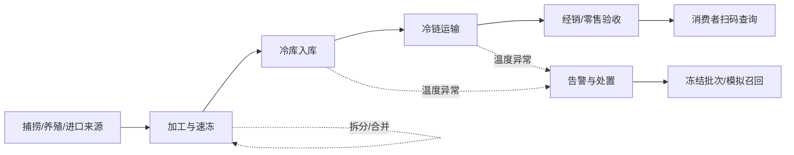

# 冷冻海产品溯源系统

面向高校实训的冷冻海产品供应链追溯原型。系统以“批次、追溯事件、批次关系”为核心，记录来源、加工速冻、仓储、运输、交接、检测和销售等关键节点，支持消费者一码查询，以及企业侧的正向追踪、反向溯源和模拟召回。

> 当前阶段：`Phase 0 / 规划与需求基线`。仓库尚未进入业务编码阶段。

## 项目边界

- 本项目是教学原型，不是政府监管平台，也不构成生产级合规认证。
- “可追溯”表示能够查询系统中已记录的信息，不代表系统能够独立证明原始数据真实。
- 本期不宣称接入真实物联网、区块链、海关、政府平台或第三方检测机构。
- 演示数据必须虚构或脱敏，不上传真实个人信息、密钥、企业证照原件。
- 当前目录中的“肉类食品溯源”材料仅供结构参考，不是本项目需求来源，也不会提交到仓库。

## MVP 业务闭环



## 已形成的项目文档

- [产品需求文档](docs/PRD.md)：产品目标、角色、功能需求、业务规则、数据模型和验收标准。
- [领域调研与依据](docs/RESEARCH.md)：法规、标准、旧参考资料差异与需求推导。
- [开发流程规范](docs/DEVELOPMENT_PROCESS.md)：从需求到发布的阶段门、Issue、分支、提交、PR、测试和发布规则。
- [参与贡献](CONTRIBUTING.md)：成员日常协作的精简入口。

## 计划中的仓库结构

```text
.
├─ server/                 # Spring Boot 服务端（设计评审后创建）
├─ web/                    # Vue 3 Web 端（设计评审后创建）
├─ database/               # 版本化迁移与演示数据
├─ tests/                  # 跨端验收与测试资产
├─ deploy/                 # 部署配置和运维说明
├─ docs/                   # 产品、调研、设计、测试与答辩资料
└─ .github/                # Issue / PR 模板与后续 CI
```

## 技术约束说明

实践任务书提出 JDK 8、Spring Boot、MyBatis-Plus、MySQL、Vue 3 的学习目标。精确版本将在架构评审时形成 ADR 后锁定：若必须使用 JDK 8，应选择兼容的 Spring Boot 2.7.x；Spring Boot 3.x 不能与 JDK 8 搭配。任务书中的 MySQL 5.5 和 Vue CLI 属于旧模板信息，未获得教师确认前不作为最终版本决策。

## 当前里程碑

- [x] 盘点本地参考资料并识别不可照搬内容
- [x] 完成领域资料检索与 PRD v0.1
- [x] 建立开发流程和 GitHub 协作模板
- [ ] 团队评审并冻结 MVP 范围
- [ ] 完成角色权限矩阵、原型、数据模型和 API 草案
- [ ] 建立最小纵向闭环：建批次 → 记事件 → 生成追溯码 → 公开查询
- [ ] 完成异常、追溯、召回、测试、部署和答辩材料

## 下一步

团队先评审 [docs/PRD.md](docs/PRD.md) 中的 8 个待确认项。范围冻结后，再进入原型、数据模型和接口设计；不要直接照着肉类参考项目开始建表或写 CRUD。
