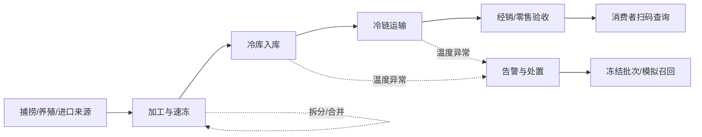

# 冷冻海产品溯源系统

面向高校实训的冷冻海产品供应链追溯原型。系统以“批次、追溯事件、批次关系”为核心，目标覆盖来源、加工速冻、仓储、运输、交接、检测、销售、消费者查询和模拟召回。当前已经实现部分后端基础模块及消费者查询页，尚未形成完整企业端正常业务链和异常召回链。

> 当前阶段：`业务模型纠偏后的 Demo MVP 重构阶段`。统一业务契约 v1.1 与 Demo MVP 路线图已经确认。后续先完成 Phase 0 基础模型纠偏，再以端到端纵向 Slice 形成 Phase A 正常业务闭环；温度异常、告警、隔离和模拟召回属于 Phase B。数据库中已有表结构或文档中的规划项不代表对应功能已经实现。

## 项目边界

- 本项目是教学原型，不是政府监管平台，也不构成生产级合规认证。
- “可追溯”表示能够查询系统中已记录的信息，不代表系统能够独立证明原始数据真实。
- 本期不宣称接入真实物联网、区块链、海关、政府平台或第三方检测机构。
- 演示数据必须虚构或脱敏，不上传真实个人信息、密钥、企业证照原件。
- 当前目录中的“肉类食品溯源”材料仅供结构参考，不是本项目需求来源，也不会提交到仓库。

## 目标 MVP 业务闭环（规划）



## 已形成的项目文档

- [统一业务契约 v1.1](docs/BUSINESS_CONTRACT_V1.1.md)：当前业务对象、状态、数量、交接运输、销售、异常和权限规则的最高优先级实现基线。
- [Demo MVP 实施路线图](docs/DEMO_MVP_ROADMAP.md)：当前实现差距、Phase 0/A/B、企业端最小页面、纵向 Slice 和验收顺序。
- [产品需求文档](docs/PRD.md)：产品目标、角色、功能需求、业务规则、数据模型和验收标准。
- [领域调研与依据](docs/RESEARCH.md)：法规、标准、旧参考资料差异与需求推导。
- [开发流程规范](docs/DEVELOPMENT_PROCESS.md)：从需求到发布的阶段门、Issue、分支、提交、PR、测试和发布规则。
- [Phase 1 交付索引](docs/phase1/README.md)：原型、权限矩阵、业务流程、数据模型、OpenAPI、ADR 与测试计划。
- [Phase 2 交付总结](docs/phase2/README.md)：后端工程骨架、8 大业务域边界、统一响应契约、Flyway 迁移与 CI 体系。
- [Phase 3 交付文档](docs/phase3/README.md)：会话认证与组织上下文（Issue #7）与产品主数据及分阶段温控规则（Issue #9）契约、安全机制、核心算法与测试验证规范。
- [服务端工程自述](server/README.md)：Java 25 / Boot 4 开发指南、MySQL 8.4 容器 (3307 端口) 启动与测试指南。
- [可交互原型](prototype/README.md)：经确认视觉稿转化的产品走查原型，不是生产 Vue 工程。
- [参与贡献](CONTRIBUTING.md)：成员日常协作的精简入口。

## 计划中的仓库结构

```text
.
├─ server/                 # Spring Boot 服务端（已建立工程骨架与 8 大业务包）
├─ web/                    # Vue 3 Web 端（已建立 Vue 3 + TS + Vite 8 生产工程与消费者查询页）
├─ database/               # 版本化迁移与演示数据
├─ tests/                  # 跨端验收与测试资产
├─ deploy/                 # 部署配置和运维说明（含 deploy/docker-compose.yml 数据库环境编排）
├─ docs/                   # 产品、调研、设计、测试与答辩资料
└─ .github/                # Issue / PR 模板与后端 CI 流水线
```

## 本地数据库快速启动

开发环境通过 Docker Compose 一键启动 MySQL 8.4 LTS 服务（宿主机端口 `3307` 隔离，避开宿主机 3306 冲突）：

```bash
# 首次启动前复制模板，并修改 .env 中的本地开发密码
cp .env.example .env

# 在仓库根目录启动数据库；显式读取根目录 .env
docker compose --env-file .env -f deploy/docker-compose.yml up -d --wait
```

## 技术约束说明

实践任务书提出 JDK 8、Spring Boot、MyBatis-Plus、MySQL、Vue 3 的学习目标。主线已通过 ADR 锁定为 Java 25 LTS + Spring Boot 4.1.1；Boot 4 使用 Spring Framework 7、Jakarta EE 11、Jackson 3 和专用模块化 starter。若教师明确强制 JDK 8，应单独回退到 Spring Boot 2.7.x，不能在 Boot 4 主线兼容。数据库以 MySQL 8.4 LTS 为团队/CI 基线（本地 Docker 映射 3307 规避 Windows 宿主机 3306 冲突），本机 MySQL 9.1.0 仅用于兼容验证；任务书中的 MySQL 5.5 和 Vue CLI 属于旧模板信息。

## 当前里程碑

- [x] 盘点本地参考资料并识别不可照搬内容
- [x] 完成领域资料检索与 PRD v0.1
- [x] 建立开发流程和 GitHub 协作模板
- [x] 用户确认 MVP 核心范围与 UI 设计方向
- [x] 完成角色权限矩阵、交互原型、数据模型和 API 草案
- [x] 完成 Phase 1 浏览器视觉走查
- [x] 完成团队/教师评审与 Phase 1 设计基线封版
- [x] 完成 Phase 2 后端工程骨架建设（Spring Boot 4.1.1 + Java 25、Flyway V1、MySQL 8.4 容器、CI 流水线）
- [x] 完成 Phase 3 会话认证与组织上下文（Issue #7：identity 安全会话、CSRF 防护、防会话固定、动态活性复核与组织上下文唯一推导）
- [x] 完成 Phase 3 产品主数据与分阶段温控规则（Issue #9：产品创建/查询/更新、乐观锁、分阶段可版本化温控基准、半开区间无重叠判定算法与不可变发布）
- [x] 完成 Phase 3 组织范围批次草稿生命周期（Issue #11：基础批次草稿创建、Idempotency-Key 幂等防重与并发竞态恢复、同组织批号排他、SQL 层组织数据隔离、单条 SQL 条件原子更新与 ACTIVE 提交流转、Flyway V3 物理 CHECK 约束）
- [x] 完成 Phase 3 批次操作、物料平衡与谱系边（Issue #13：批次操作草稿创建与提交、服务端物料平衡重新计算、引用批次活性/组织归属校验、输出批次唯一产出与声明量校验、输入批次累计量防超额、MySQL 8.4 recursive CTE 环检测、双幂等机制、不可变谱系边与 Flyway V4 物理约束）
- [x] 完成 Phase 3 追加式追溯事件与更正工作流（Issue #15：10类标准事件录入、受控 detailsJson 扩展属性校验、双时间维度输出、同组织操作员鉴权、防分叉链式更正、写路径批次行锁防 TOCTOU、锁后当前读幂等恢复与 Flyway V5 物理约束）
- [x] 完成 Phase 3 公开追溯码与消费者公开投影（Issue #17 / PR #18：26 位 RFC 4648 Base32 唯一编码、内部 token_hash SHA-256 哈希索引、企业端激活与终态停用、统一幂等记录表持久绑定与组织隔离、消费者匿名免认证免 CSRF 白名单安全投影、敏感自由文本隔离、温度 INSUFFICIENT_DATA 诚实声明、RECALLED 模拟召回演练声明与 Flyway V6 物理约束）
- [x] 完成 Phase 3 响应式消费者追溯 Web 生产前端（Issue #19 / PR #20 已合并到主分支：Vue 3 + TypeScript + Vite 8、移动优先查询页、真实性披露、Vitest、Playwright、真实 Vue → Spring Boot → MySQL 8.4 冒烟与独立前端 CI）
- [x] 完成 Phase 3 企业间整批交接生命周期（Issue #21：FR-TRANSFER-001 跨组织整批交接生命周期 DRAFT -> PENDING -> ACCEPTED | REJECTED、双时间维度独立留痕、批次持有组织原子转移与数量快照防篡改、拒收不转移与不生成事件、同名批次排他回滚、在途批次加工排他预留、多动作独立幂等表、open_batch_id 虚拟生成列排他唯一索引与 Flyway V7 物理约束）
- [x] 确认统一业务契约 v1.1 与 Demo MVP 实施路线图
- [x] 完成 Phase A Slice 2：Transfer + Shipment（Flyway V9；运输任务 PLANNED → IN_TRANSIT → DELIVERED / CANCELLED；提交前必须绑定 PLANNED 运输任务、到达后接收方才能接受或拒收；TRANSPORT / ARRIVAL 仅由运输任务发运 / 到达按批次各生成一条，ACCEPT 不再生成 ARRIVAL；发出交接、运输任务、承运与待接收生产页面；真实三账号浏览器验收 `npm run test:smoke`，手工验收 `SMOKE_KEEP=true npm run test:smoke`）
  - Demo MVP Phase A 阶段性限制：承运方必须是独立的 `CARRIER` 类型组织，承运组织不能作为发货方或交接接收方。统一业务契约 v1.1 未规定承运方必须与发送 / 接收方不同，因此该限制只在应用层执行，没有写入数据库永久约束。
- [ ] 完成 Phase 0：Batch 双状态、双编号及企业端基础壳纠偏
- [ ] 完成 Phase A：来源建批至消费者查询的正常业务闭环
- [ ] 完成 Phase B：温度异常、隔离与模拟召回闭环
- [ ] 完成综合测试、部署和答辩材料

## 下一步

按照 [Demo MVP 实施路线图](docs/DEMO_MVP_ROADMAP.md) 从 Phase 0 开始：先收敛 Batch 双状态、双编号和企业端基础壳，再按“来源建批 → Transfer + Shipment → PROCESS/SPLIT → 自有冷库 → 终端 Sale → PublicTraceCode 与消费者查询”的纵向 Slice 推进 Phase A。

在 Phase A 完成并通过 3～5 分钟真实业务演示前，暂停 FR-COLD-001A、TemperatureRecord、Alert、QUARANTINED、Freeze/Recall、InspectionReport、第三方仓储和企业端完整图谱。当前 Shipment 只有数据库表、Sale 尚不存在，TemperatureRecord、Alert、InspectionReport、Recall 也没有可执行 Java/API，不得描述为已完成功能。
