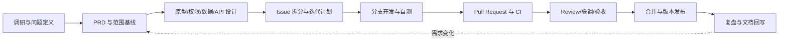

# 开发流程与协作规范

版本：v0.1　　生效范围：冷冻海产品溯源系统实训团队

## 1. 总原则

- 先形成证据和需求基线，再做原型、设计和代码。
- 每项开发工作必须由 Issue 驱动，并引用 PRD 功能编号。
- 使用 `main + 短生命周期分支`，不维护长期 `develop` 分支。
- 所有代码通过 Pull Request 合入；主分支不直接开发。
- 小步提交、小 PR、可复现验证；文档和测试属于功能的一部分。
- 不提交密钥、真实个人信息、真实证照和无发布授权的参考资料。
- 不把模拟能力描述成真实接入，不把录入数据描述成防伪证明。

## 2. 端到端开发流程



### Phase 0：调研与范围冻结

输入：实践任务书、旧参考资料、法规/标准、团队与工期约束。

活动：

1. 区分正式需求、可借鉴结构和不适用内容。
2. 确认用户、场景、业务闭环、P0/P1/P2 和明确不做项。
3. 为法规或业务事实记录来源和检索日期。
4. 编写 PRD、术语表、需求追踪矩阵和待确认项。
5. 召开范围评审，评审意见通过 Issue 留痕。

退出条件：PRD 形成基线版本；每个 P0 功能可测试；所有关键待决项已有负责人和截止时间。

### Phase 1：产品与技术设计

交付物：

- 页面清单、低保真原型和关键异常状态。
- 角色权限矩阵，明确角色、资源、动作和数据范围。
- 业务流程、批次状态机、交接状态机和异常闭环。
- ER 图、数据字典、批次谱系约束和数据库迁移方案。
- OpenAPI 接口草案、统一响应/错误码、分页和时间格式。
- 架构决策记录 ADR，至少包含 JDK/Spring Boot/MySQL/Vue 版本选择。
- 测试计划与演示数据计划。

退出条件：原型、权限、数据和接口之间无明显冲突；最小纵向闭环可以按任务拆分。

### Phase 2：迭代开发

推荐顺序：

1. 工程骨架、配置分层、数据库迁移、CI 基线。
2. 登录、权限、组织隔离和基础数据。
3. 批次创建、追溯事件、公开追溯码和消费者查询，先跑通纵向闭环。
4. 企业交接、批次拆分/合并和正反向追溯。
5. 温度、检测、告警、冻结、模拟召回和审计。
6. P1 看板、导入导出和体验优化。

每个功能遵循：`Issue Ready → 建分支 → 编码/测试 → 本地自检 → PR → Review/CI → 合并 → 验收`。

### Phase 3：联调与验收

- 按 PRD 的 12 个验收场景执行，不以“页面能打开”代替验收。
- 固定版本化演示数据，保存预期追溯图和召回范围。
- 执行 API、权限、跨组织隔离、上传、公开字段、异常状态和性能基线测试。
- 缺陷使用 Issue 管理，标明严重度、复现步骤、环境和证据。
- 阻断级或高严重度缺陷清零后才能进入发布候选。

### Phase 4：发布与复盘

- 冻结发布候选提交，更新 CHANGELOG、部署文档、已知问题和演示脚本。
- 在干净环境执行一次完整部署和演示。
- 创建语义化版本 tag；首个可验收版本为 `v0.1.0`。
- GitHub Release 写明范围、启动方式、数据版本、已知限制和校验结果。
- 复盘需求偏差、缺陷原因、协作问题，并把有效结论回写文档。

## 3. Issue 规范

### 3.1 工作项类型

| 类型 | 用途 |
|---|---|
| `type:feature` | 新功能或用户可见能力 |
| `type:bug` | 已有行为偏离需求或设计 |
| `type:docs` | 文档、原型、数据字典、答辩材料 |
| `type:test` | 自动化、验收、性能和安全测试 |
| `type:refactor` | 不改变外部行为的内部改进 |
| `type:chore` | 构建、依赖、工具和仓库维护 |

推荐补充 `priority:P0/P1/P2`、`area:server/web/data/devops/docs`、`status:blocked` 标签。

看板状态统一为：`Backlog → Ready → In Progress → In Review → Done`。同一成员同时处于 `In Progress` 的 Issue 原则上不超过 2 个。

### 3.2 Definition of Ready

Issue 进入 `Ready` 前必须具备：

- 清楚的背景、目标和不做项。
- 对应 PRD 功能编号，或说明为何不适用。
- 可客观判断的验收条件。
- UI/API/数据影响和依赖已识别。
- 规模足够小，理想情况下 1～2 天内可完成；过大则继续拆分。
- 没有阻塞开发的关键产品决策。

### 3.3 缺陷 Issue

至少包含环境、前置数据、复现步骤、实际结果、预期结果、日志/截图和影响范围。严重度建议：

- S0：数据严重破坏、密钥泄漏或系统完全不可用。
- S1：越权、数据串组织、核心闭环不可用。
- S2：主要功能错误但有临时绕过方法。
- S3：轻微显示、易用性或文档问题。

## 4. 分支规范

### 4.1 分支模型

- `main`：始终保持可构建、可测试；只能通过 PR 合入。
- 功能分支：从最新 `main` 创建，完成后删除。
- 不建立长期个人分支或长期 `develop`，避免大规模冲突。

命名：

```text
feat/23-batch-create
fix/41-trace-permission
docs/12-prd-review
test/37-recall-flow
chore/8-ci-bootstrap
```

要求：小写英文、短横线分隔，必须带 Issue 编号，不使用姓名或“final/new/test”等无信息名称。

### 4.2 同步与冲突

- 开工前更新本地 `main`，从它创建功能分支。
- 开发期间保持分支短小；需要同步时优先 rebase 本地功能分支。
- 禁止对共享分支和 `main` 强制推送。
- 冲突由分支作者处理，解决后重新执行测试。

## 5. 提交规范

采用 Conventional Commits：

```text
<type>(<scope>): <summary>
```

常用类型：`feat`、`fix`、`docs`、`test`、`refactor`、`chore`、`build`、`ci`。

示例：

```text
feat(batch): support split and merge relations
fix(trace): reject cyclic batch relation
docs(prd): clarify public trace fields
test(auth): cover cross-organization access
```

规则：

- 一次提交只表达一个逻辑变化，代码、测试和必要文档可放在同一提交。
- 摘要使用祈使语义，说明“做了什么”，不要写“update”“修改一下”。
- 破坏性变更在正文中写 `BREAKING CHANGE:` 并说明迁移办法。
- 禁止提交构建产物、日志、真实数据、密钥、个人 IDE 文件和本地参考资料。

## 6. Pull Request 规范

### 6.1 PR 内容

- 一个 PR 只解决一个主题，并使用 `Closes #<issue>` 关联 Issue。
- 标题遵循提交格式，例如 `feat(batch): add batch creation flow`。
- 描述必须包含改动、原因、验证方式、影响、风险和回滚方案。
- UI 变化附截图；接口变化附请求/响应样例并更新 OpenAPI；数据库变化附迁移和回滚说明。
- PR 建议控制在约 400 行有效改动内；自动生成文件和机械性变更单独说明。超大 PR 必须拆分或解释原因。

### 6.2 Review 清单

审查者重点检查：

1. 是否满足 Issue 验收条件，是否偷偷扩大范围。
2. 角色、组织和公开数据边界是否在服务端落实。
3. 批次关系、状态变化、数量/单位和事务是否一致。
4. 是否保留审计、更正和数据来源，是否存在物理删除历史。
5. 异常路径、空数据和重复请求是否处理。
6. 测试是否能在没有作者解释的情况下复现结果。
7. 文档、迁移、接口与代码是否同步。

至少 1 名非作者成员批准、必需 CI 全绿后才能合并。推荐 Squash Merge；合并后删除分支。

### 6.3 主分支保护目标

- 禁止直接 push 和强推。
- PR 至少 1 个批准。
- 必需状态检查通过，过期批准在关键代码变化后失效。
- 对话全部解决后才能合并。
- 开启 secret scanning 时使用它；否则在 CI 中加入等价的敏感信息检查。

## 7. 代码与接口约定

### 7.1 通用约定

- 文件统一 UTF-8、LF；时间入库存 UTC，接口使用 ISO 8601 并含时区。
- 金额、重量和温度避免二进制浮点误差，类型与精度在数据字典中定义。
- 业务枚举和状态转换集中管理，不在页面和多个服务中散落魔法字符串。
- 所有外部输入在服务端校验；错误响应使用稳定错误码，不向客户端泄露堆栈。
- 日志不得记录密码、令牌、身份证明、完整联系方式或附件内容。

### 7.2 服务端分层

- Controller：协议适配、参数校验和权限入口，不堆积业务规则。
- Service/Application：用例编排、事务和授权后的业务动作。
- Domain：批次关系、状态机、告警等核心规则。
- Repository/Mapper：持久化访问，不把数据库模型直接暴露给公开接口。
- DTO：企业端与消费者端分离，消费者响应采用专门白名单 DTO。

### 7.3 前端约定

- 页面权限只负责体验，安全结论以服务端为准。
- API 调用、错误处理、时间/单位格式化集中封装。
- 表单必须展示必填、单位、限制和服务端错误；危险操作二次确认。
- Loading、空状态、错误状态、无权限、失效码和召回状态都要设计。

### 7.4 数据库变更

- 所有结构和基础字典变更使用按序号命名的迁移文件，例如 `V003__create_batch_relation.sql`。
- 已在共享环境执行的迁移不得直接修改；新增修正迁移。
- 迁移与代码在同一 PR 中，包含前向执行、兼容/回滚说明和测试数据影响。
- 禁止以个人数据库截图或导出的完整库文件代替迁移。

## 8. 测试策略

| 层级 | 最低要求 |
|---|---|
| 单元测试 | 批次状态机、拆分/合并、循环阻止、温控规则、权限判断 |
| 服务/API 集成测试 | 数据库约束、事务、组织隔离、交接、追溯和召回 |
| 前端组件测试 | 关键表单校验、状态展示、公开字段映射 |
| 端到端测试 | PRD 的核心演示链和消费者查询 |
| 安全测试 | 越权、跨组织访问、公开字段泄漏、上传限制、敏感日志 |
| 性能测试 | PRD 规定数据量与并发下的 P95 基线 |

命名建议：测试用例引用功能编号，例如 `TC-FR-BATCH-002-01`。修复缺陷时先补能复现问题的测试，再提交修复。

## 9. CI 质量门

代码骨架建立后，CI 至少包含：

1. Markdown/YAML 和基础格式检查。
2. 服务端编译、单元测试和静态检查。
3. 前端依赖锁定安装、lint、类型检查、测试和生产构建。
4. 数据库迁移在临时数据库从零执行。
5. 依赖漏洞和敏感信息扫描；发现高危问题阻止合并。
6. 后续加入端到端冒烟测试。

依赖升级单独开 PR；大版本升级必须写 ADR 和迁移验证。锁文件必须提交，不允许 CI 与本地使用不同的包管理器。

## 10. 配置、数据与安全

- 仓库只提交 `.env.example`，真实 `.env` 由成员本地保存。
- 演示账号由 seed 脚本生成；README 只说明生成方式，不保存生产密码。
- 附件和演示数据使用虚构内容，并带 `DEMO` 或 `SIMULATED` 标识。
- 原始课程 DOCX、Axure、截图不进入 Git；确需引用时只写自己总结的结论和来源位置。
- 怀疑密钥泄漏时立即撤销/轮换，再清理历史；不能只删除最新提交。
- 日志、数据库备份、上传目录和构建产物不纳入版本控制。

## 11. 文档同步规则

| 变化 | 同一 PR 必须更新 |
|---|---|
| 功能范围/业务规则 | PRD、验收用例、必要的原型 |
| 接口请求/响应 | OpenAPI、前后端调用、接口测试 |
| 数据表/枚举/约束 | 迁移、数据字典、相关测试 |
| 架构或技术版本 | ADR、README、构建/部署说明 |
| 用户可见行为 | README/使用说明、CHANGELOG |
| 演示流程 | seed 数据、演示脚本、预期结果 |

## 12. Definition of Done

Issue 只有同时满足以下条件才可关闭：

- 验收条件全部通过，没有未说明的范围偏差。
- 代码已 Review 并通过 PR 合入主分支。
- 自动化测试、构建和必需检查通过。
- 权限、审计、异常和日志已按影响范围检查。
- 接口、数据字典、迁移、README/CHANGELOG 等文档已同步。
- 没有真实密钥、个人信息、证照或未授权资料进入仓库。
- 在集成环境可演示，PR 已关联 Issue 和 PRD 功能编号。

## 13. 需求变更流程

范围基线后，任何新增或重大修改都必须创建 `type:feature` 或 `type:change` Issue，说明：

1. 变更原因和证据。
2. 受影响的 PRD 编号、页面、API、数据、测试和进度。
3. 新增工作量以及为了保持工期要移除或降级的事项。
4. 兼容、迁移和回滚方案。
5. 产品负责人和技术负责人评审结果。

紧急缺陷可以先控制风险，但事后仍需补 Issue、测试、根因和文档，不允许形成永久口头需求。

## 14. 团队职责建议

同一成员可以兼任，但每项职责必须有明确负责人：

- 产品/需求：维护 PRD、范围、验收和变更。
- 技术负责人：架构、ADR、接口与数据一致性、代码评审。
- 服务端：权限、业务规则、数据和 API。
- 前端：企业端、管理端、消费者端和可用性。
- 测试/发布：测试计划、数据、缺陷、CI、部署和演示复现。

## 15. 当前阶段的下一步

1. 团队逐项确认 PRD 的待确认项，发布需求基线。
2. 创建 M1 Issue：权限矩阵、业务状态机、原型、ER 图、API 草案、技术版本 ADR、测试计划。
3. M1 评审通过后才创建 `server/`、`web/` 和数据库工程骨架。
4. 第一轮开发只做“创建批次 → 记录事件 → 生成追溯码 → 消费者查询”的最小纵向闭环。
