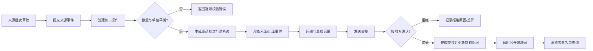
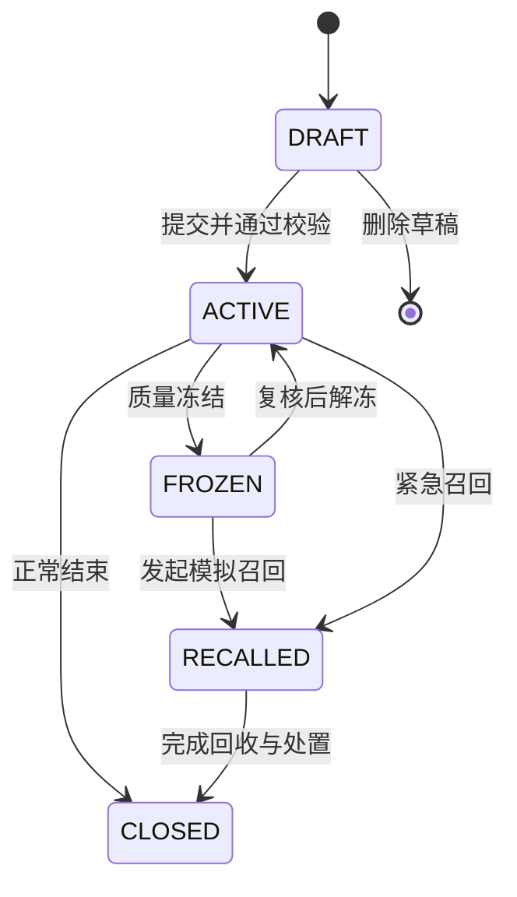
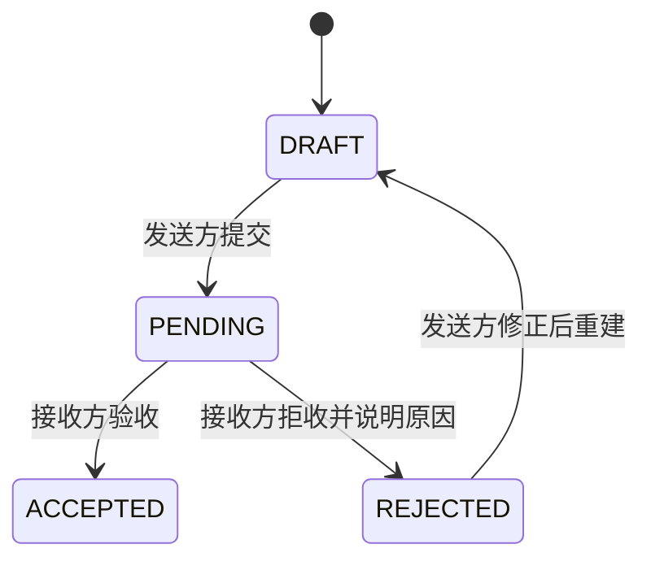
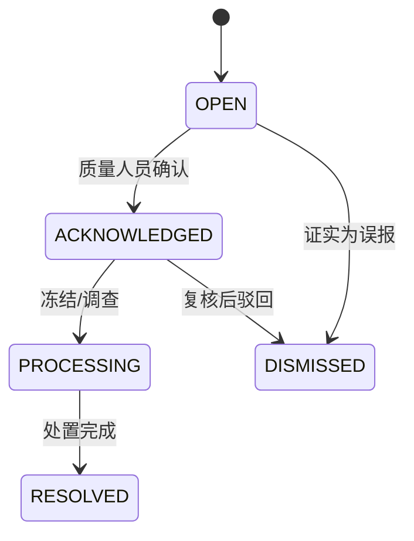
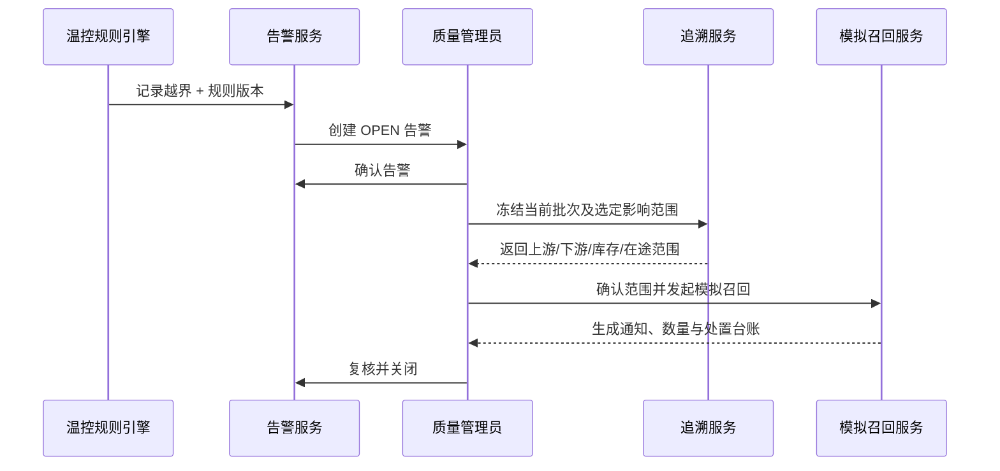

# 业务流程与状态机

## 1. 主业务流程

批次操作的校验式：`Σ 标准化投入 = Σ 标准化产出 + 损耗 + 废弃 + 留样`。如果单位不同，必须先使用已记录的换算规则得到同一计量维度。

## 2. 批次状态机

| 当前状态 | 允许动作 | 禁止动作 |
|---|---|---|
| `DRAFT` | 编辑、删除、提交 | 对外查询、交接、下游操作 |
| `ACTIVE` | 记事件、交接、拆合、公开查询 | 物理删除已提交事件 |
| `FROZEN` | 查看、处置、解冻、召回 | 新发货、接收、销售、生成下游批次 |
| `RECALLED` | 通知、回收、处置、关闭 | 新业务流转 |
| `CLOSED` | 只读、追加更正/审计说明 | 普通业务变更 |

## 3. 交接状态机

- 提交时锁定批次、数量、单位、发货方、收货方和业务发生时间快照。
- 接收方接受时记录签收数量、差异、业务签收时间和系统记录时间。
- `ACCEPTED/REJECTED` 为终态；重复请求使用幂等键返回原结果。
- 冻结或召回批次不能提交或接受交接。

## 4. 告警与异常闭环

## 5. 追溯事件更正

已提交事件不可覆盖：

1. 用户选择需要更正的事件并填写原因。
2. 系统复制原记录为更正输入，保存修改后的新版本。
3. 新记录通过 `corrects_event_id` 指向原记录；原记录状态变为 `CORRECTED`，但仍可读。
4. 审计日志保存字段级差异摘要；附件通过新关联追加，原附件不物理删除。

## 6. 幂等与并发

- 创建批次操作、接受/拒绝交接、冻结、发起召回必须支持 `Idempotency-Key`。
- 可变聚合使用 `version` 乐观锁；冲突返回 `409 CONFLICT` 和稳定错误码。
- 同一批次的状态变化、批次操作和交接确认在单数据库事务中完成。

