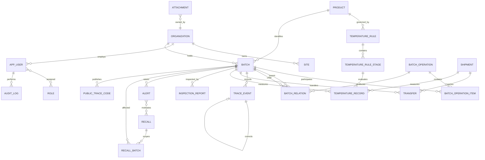

# 数据模型、谱系约束与迁移方案

## 1. 建模原则

1. `batch` 表示可追溯批次，不按企业类型拆成多套批次表。
2. `trace_event` 表示业务事实，必须同时保存业务发生时间与系统记录时间。
3. `batch_operation` 与 `batch_operation_item` 表示一次拆分、合并、加工或分装及其物料平衡。
4. `batch_relation` 是由已提交批次操作产生的父子边，用于高效正反向遍历；不能脱离操作单独编辑。
5. 已提交业务记录采用追加式更正，核心历史不物理删除。

## 2. 核心 ER 图



## 3. 批次操作与物料平衡

`batch_operation_item.role` 取值：

- `INPUT`：投入批次。
- `OUTPUT`：产出批次。
- `LOSS`：合理加工损耗。
- `WASTE`：废弃/报废。
- `SAMPLE`：留样。

每个项目同时保存原始数量、原始单位、标准化数量和换算规则 ID。提交操作时必须满足：

```text
sum(normalized_quantity where role = INPUT)
= sum(normalized_quantity where role in OUTPUT, LOSS, WASTE, SAMPLE)
```

允许在配置中设置舍入容差，MVP 默认同一质量维度的容差为 `0.001 kg`。容差不是额外损耗；超出容差必须显式登记项目。

示例：

```text
600 kg INPUT + 420 kg INPUT
= 480 kg OUTPUT + 520 kg OUTPUT + 20 kg LOSS
= 1,020 kg
```

## 4. 谱系约束

| 约束 | 实现位置 | 失败错误码 |
|---|---|---|
| 父批次不能等于子批次 | DB `CHECK` + Domain | `BATCH_RELATION_SELF_LOOP` |
| 同一操作内至少一个投入和一个产出 | Domain | `BATCH_OPERATION_ITEMS_REQUIRED` |
| 提交前数量必须平衡 | Domain + 事务内复核 | `BATCH_MASS_BALANCE_VIOLATION` |
| 计量维度不兼容时禁止换算 | Domain | `UNIT_DIMENSION_MISMATCH` |
| 新边不能形成环 | 递归 CTE + Domain | `BATCH_RELATION_CYCLE` |
| 已提交操作不可修改/删除 | Domain + 权限 | `IMMUTABLE_RECORD` |
| 冻结/召回批次不能产生新流转 | Domain | `BATCH_FLOW_BLOCKED` |
| 父子边只能来自已提交操作 | 外键 + Domain | `OPERATION_NOT_SUBMITTED` |

### 4.1 环检测

新增 `parent -> child` 前，从 `child` 沿现有下游边递归查询；若可到达 `parent`，则拒绝。检查与写入在同一事务中完成，并按参与批次 ID 排序加锁，降低并发插边产生环的风险。

查询保护：默认深度 12，最大深度 50，最大节点 5,000。达到限制时响应返回 `truncated=true`、`visitedNodes` 和 `maxDepthReached`，不得静默丢失结果。

## 5. 时间、单位和来源

- 数据库存 UTC `DATETIME(6)`；API 返回带偏移量的 ISO 8601。
- `occurred_at` 是业务发生时间；`recorded_at` 是系统接收并保存时间，由服务端生成。
- 单位必须引用 `unit_code`；数量和温度不得使用二进制浮点数。
- 数据来源枚举：`MANUAL`、`IMPORT`、`SIMULATED`、`DEVICE`。MVP 不把前三者展示成设备实采。
- 温度记录保存 `rule_stage_id`、规则版本、判定结果和判定时间，防止规则更新后历史结论漂移。

## 6. 索引基线

| 表 | 索引 |
|---|---|
| `batch` | `uk_batch_org_no(org_id,batch_no)`；`idx_batch_product_status(product_id,status)` |
| `batch_relation` | `uk_relation(operation_id,parent_batch_id,child_batch_id)`；父/子双向索引 |
| `trace_event` | `(batch_id,occurred_at,id)`；`(org_id,event_type,recorded_at)` |
| `transfer` | `(sender_org_id,status)`；`(receiver_org_id,status)`；幂等键唯一 |
| `temperature_record` | `(batch_id,measured_at,id)`；`(shipment_id,measured_at,id)` |
| `alert` | `(org_id,status,severity,created_at)` |
| `public_trace_code` | `uk_public_token_hash(token_hash)`；禁止存明文可猜测序列 |
| `audit_log` | `(org_id,occurred_at,id)`；`(object_type,object_id,occurred_at)` |

## 7. 数据库迁移计划

| 迁移 | 内容 | 回滚/兼容说明 |
|---|---|---|
| `V001` | 组织、场所、用户、角色、用户角色 | 仅空库回滚；后续用补偿迁移 |
| `V002` | 产品、单位、温控规则与阶段 | 规则发布后不可删除 |
| `V003` | 批次、公开追溯码 | 公开 ID 与内部 ID 分离 |
| `V004` | 批次操作、项目、谱系关系 | 加入数量精度、环检查所需索引 |
| `V005` | 追溯事件与更正关联 | 已提交事件追加式更正 |
| `V006` | 运输、交接与温度记录 | 时间序列索引 |
| `V007` | 检测、告警、召回及范围 | 召回数量分类 |
| `V008` | 附件与审计日志 | 二进制不入数据库，只存元数据 |
| `V009` | 基础字典和演示组织 | 幂等 seed，所有数据带 `DEMO` |
| `V010` | 三条演示链及预期谱系 | 版本化演示数据 |

迁移一经共享环境执行不得修改原文件。结构修正使用新迁移；生产式回滚优先使用兼容的前向补偿迁移。CI 每次从空 MySQL 8.4 执行全部迁移，并验证关键唯一约束与外键。

## 8. 数据保留与删除

- 草稿且未被引用的批次可物理删除。
- 已提交事件、批次操作、关系、交接、检测、告警、召回和审计不得由业务页面物理删除。
- 用户/组织/产品使用停用状态；历史引用继续可读。
- 附件删除采用受控作废：保留元数据、哈希、作废人和原因；二进制保留期由部署策略配置。

