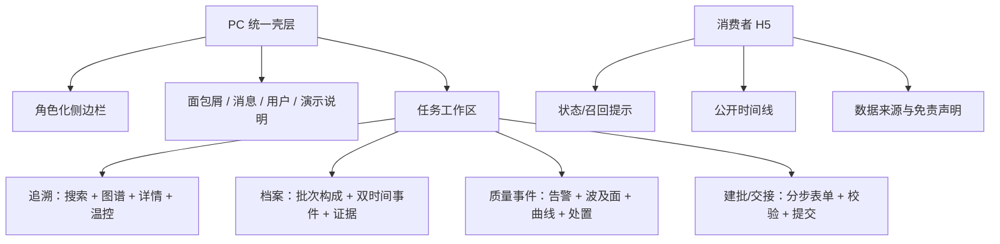
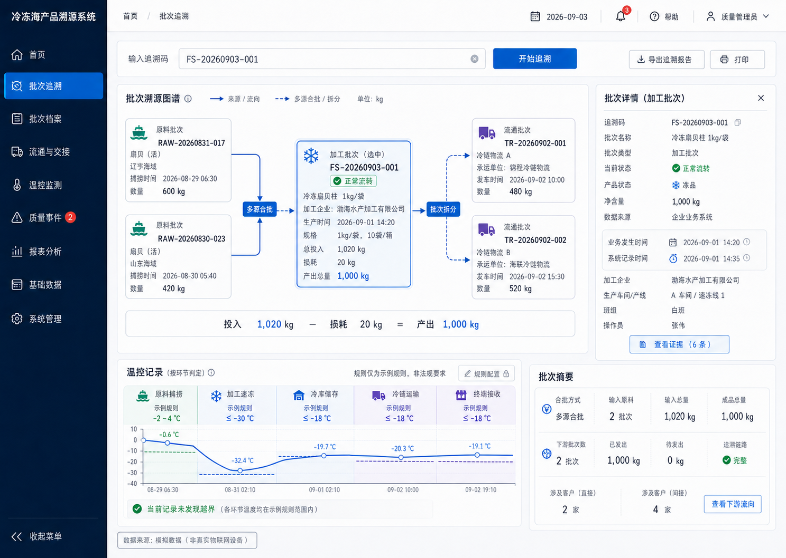

# 产品与交互设计基线

## 1. 产品表面

| 表面 | 主要用户 | 布局 | 最小宽度 |
|---|---|---|---:|
| PC 企业/质量/系统端 | 操作员、质量管理员、系统管理员、审计查看者 | 深色侧边栏 + 白色全局工具条 + 主内容区 | 1180 px |
| 消费者响应式 Web | 消费者 | 单列卡片与关键时间线，无需登录 | 360 px |

所有演示页面必须显著展示“数据来源：模拟数据（非真实物联网设备）”。消费者页还必须说明：查询结果不构成防伪、真实性或第三方认证。

## 2. 页面清单

| ID | 页面 | P | 主要动作 | 关键异常/空状态 | PRD |
|---|---|---:|---|---|---|
| P-AUTH-01 | 统一登录 | P0 | 登录、退出 | 账号停用、密码错误、会话过期 | FR-AUTH-001 |
| P-HOME-01 | 工作台 | P1 | 查看待办和异常 | 无待办、数据加载失败 | FR-DASH-001 |
| P-BATCH-01 | 批次列表 | P0 | 筛选、新建、查看 | 空列表、无权限、冻结筛选 | FR-BATCH-001 |
| P-BATCH-02 | 新建/编辑批次向导 | P0 | 基础信息、原料关联、工艺、附件 | 数量不平衡、单位不兼容、重复批号 | FR-BATCH-001/002 |
| P-BATCH-03 | 批次档案与证据链 | P0 | 查看事件、双时间、证据 | 证据待补、更正记录、附件无权限 | FR-EVENT-001/QA-001 |
| P-TRACE-01 | 批次追溯图谱 | P0 | 搜索、正反向遍历、节点下钻、导出 | 无效码、循环保护、深度截断、无关联 | FR-TRACE-001 |
| P-TRANSFER-01 | 交接列表/详情 | P0 | 提交、接受、拒绝 | 数量差异、重复确认、批次被冻结 | FR-TRANSFER-001 |
| P-COLD-01 | 温控监测 | P0 | 按环节查看、录入/导入 | 越界、断档、错误单位、规则失效 | FR-COLD-001 |
| P-QA-01 | 检测报告 | P0 | 录入摘要、审核 | 不合格、附件缺失、机构未验证声明 | FR-QA-001 |
| P-RISK-01 | 质量事件详情 | P0 | 确认、冻结、范围确认、模拟召回 | 重复处置、无影响批次、权限不足 | FR-RISK-001 |
| P-RECALL-01 | 模拟召回详情 | P0 | 通知摘要、数量回收、关闭 | 数量不守恒、未完成处置、已关闭 | FR-RISK-001 |
| P-PUBLIC-01 | 消费者查询 | P0 | 输入/扫码查询、查看公开履历 | 无效码、停用码、召回码、系统繁忙 | FR-TRACE-002 |
| P-MASTER-01 | 产品与温控规则 | P0 | 维护规则、发布版本 | 生效期冲突、已引用版本不可改 | FR-PROD-001 |
| P-ADMIN-01 | 组织/场所/用户/角色 | P0 | 管理主体和权限 | 停用对象仍被引用、越权 | FR-ORG-001 |
| P-AUDIT-01 | 审计日志 | P0 | 条件查询、查看变更摘要 | 敏感值脱敏、只读 | FR-AUDIT-001 |

## 3. 低保真信息结构

## 4. 高保真视觉基准

可交互原型位于 [prototype/](../../prototype/)，包含：

- 节点点击后刷新右侧批次详情。
- 输入错误追溯码后展示明确错误态。
- 批次档案中的双时间戳与证据状态。
- 质量事件四步处置演示。
- 新建加工批次四步向导与数量平衡。
- 消费者正常/模拟召回状态切换。

## 5. 设计令牌

| Token | 值 | 用途 |
|---|---|---|
| `color-primary` | `#0284C7` | 主操作、选中态 |
| `color-primary-strong` | `#0369A1` | Hover、强调 |
| `color-sidebar` | `#0F2742` | PC 侧栏 |
| `color-cold` | `#38BDF8` | 低温和冷链信息 |
| `color-success` | `#10B981` | 正常/完成 |
| `color-warning` | `#F59E0B` | 待补/临界 |
| `color-danger` | `#EF4444` | 越界/冻结/召回 |
| `color-canvas` | `#F8FAFC` | 页面背景 |
| `color-border` | `#E2E8F0` | 分隔和卡片边框 |
| `radius-card` | `8px` | 内容卡片 |

中文正文优先系统无衬线字体；批次号、时间、温度、数量使用等宽数字。状态同时使用文字、图标和颜色，颜色不是唯一信号。焦点态必须可见，正文与背景对比度目标不低于 WCAG AA。

## 6. 不可破坏的交互规则

1. 图谱是有向无环谱系的投影，界面不得把合批或拆分降级成普通线性时间线。
2. “业务发生时间”与“系统记录时间”不得合并成一个“时间”。
3. 温控判定按产品、任务、环节和规则版本；不得绘制跨全部环节的单一 `-18 ℃` 红线。
4. 已提交事件仅允许追加更正；页面必须能查看原记录、改后值、原因和操作人。
5. 危险动作顺序为确认事件 → 冻结范围 → 确认影响 → 发起模拟召回；每步记录操作者与系统时间。
6. 消费者页面只展示公开白名单；内部员工、精确设备标识和受控附件不得出现。

## 7. 关键状态文案

| 状态 | 标题 | 行动 |
|---|---|---|
| 无效追溯码 | 未找到该追溯码 | 检查字符后重试 |
| 停用追溯码 | 该查询码已停用 | 联系商品销售方 |
| 召回批次 | 该批次正在进行模拟召回 | 暂停使用并查看演示处置说明 |
| 无权限 | 你无权查看该批次 | 返回列表；记录拒绝访问审计 |
| 图遍历截断 | 关联范围较大，结果已按安全上限截断 | 缩小方向或筛选条件 |
| 证据待补 | 事件已记录，凭证尚未齐全 | 上传凭证或登记待补原因 |
| 温控断档 | 指定时段缺少温度记录 | 核查数据来源并创建质量事件 |

