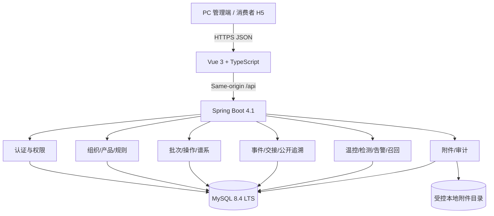

# 技术架构设计

## 1. 架构结论

采用“Vue 3 SPA + Spring Boot 模块化单体 + MySQL 8.4”的单仓库方案。实训周期内不拆微服务；模块边界通过 Java 包、应用服务和数据库迁移维护，将来确有独立扩缩容需求再拆分。



## 2. 技术栈基线

| 层 | 选择 | 基线 |
|---|---|---|
| JDK | Eclipse Temurin | Java 25 LTS；`release=25` |
| 服务端 | Spring Boot | 4.1.1；Spring Framework 7、Jakarta EE 11 |
| 构建 | Maven Wrapper | Maven 3.9.x |
| Web | `spring-boot-starter-webmvc` | Servlet 6.1；不使用已弃用的旧 Web starter 名称 |
| JSON | Jackson 3 | 由 Boot BOM 管理；DTO 序列化契约纳入测试 |
| 数据访问 | `mybatis-plus-spring-boot4-starter` | MyBatis-Plus 3.5.17 |
| 安全 | Spring Security 7 | 由 Boot BOM 管理 |
| 迁移 | `spring-boot-starter-flyway` | 由 Boot BOM 管理；迁移脚本入库 |
| 数据库 | MySQL | 8.4 LTS 可复现基线；本机 9.1.0 仅兼容验证 |
| API | REST + OpenAPI 3.1 | `/api/v1` |
| 前端 | Vue 3 + TypeScript | Vue 3 当前稳定小版本 |
| 工具链 | Node.js 24 LTS + Vite 8 | 锁文件固定补丁版本 |
| UI | Element Plus | 当前稳定 2.x，按需导入 |
| 状态/路由 | Pinia + Vue Router | 当前稳定版 |
| 图谱 | AntV X6 | 只读 DAG、节点下钻、路径高亮 |
| 图表 | Apache ECharts 6 | 温控曲线、分段规则、可访问描述 |
| 服务端测试 | JUnit 5, AssertJ, Testcontainers | 由 BOM/构建配置锁定 |
| 前端测试 | Vitest + Vue Test Utils | 组件与状态 |
| E2E | Playwright | 核心演示链 |

说明：开发机已验证 Temurin 25.0.3、Maven 3.9.6 和 MySQL Server 9.1.0。项目统一使用 Java 25；数据库仍由 Compose/Testcontainers 固定 MySQL 8.4 LTS，避免把个人电脑上的短周期 Innovation 版本变成团队隐式依赖。若教师强制 Java 8，则启用 ADR-001 的兼容回退方案，而不是在同一主线兼容两套运行时。

## 3. Java 模块边界

```text
com.example.traceability
├─ common          # 错误、时间、ID、分页、审计上下文
├─ identity        # 登录、用户、角色、组织范围
├─ masterdata      # 组织、场所、产品、单位、温控规则
├─ batch           # 批次、批次操作、谱系约束和数量平衡
├─ trace           # 追溯事件、交接、正反向查询、公开投影
├─ quality         # 温度、检测、告警、冻结和模拟召回
├─ attachment      # 受控文件元数据与存储端口
└─ audit           # 追加式审计日志
```

每个业务模块内部使用 `web/application/domain/infrastructure` 分层。Controller 只处理协议、校验和权限入口；事务放在应用服务；数量平衡、状态转换、循环检查等规则不写进 Controller 或 Mapper。

## 4. 认证与安全边界

- 同源部署使用 Spring Security 服务端会话和 `HttpOnly + Secure + SameSite=Lax` Cookie。
- 状态修改接口启用 CSRF 防护；前端不把令牌写入 `localStorage`。
- 密码使用自适应哈希；开发/演示账号由 seed 生成并要求首次修改。
- 公开接口使用独立 Controller、查询模型和响应 DTO，不与企业端实体复用。
- 附件下载先校验访问级别、组织范围和对象关系，再返回受控流。

## 5. 数据与事务策略

- 内部 ID 使用 `BIGINT UNSIGNED`；公开追溯 ID 使用至少 128 bit 随机值的 Base32/URL-safe 表达。
- 时间在数据库使用 UTC `DATETIME(6)`；API 使用 ISO 8601 偏移时间。
- 数量用 `DECIMAL(18,3)`，温度用 `DECIMAL(6,2)`，禁止 `float/double` 承载业务量。
- 关系写入前执行 DAG 循环检查；操作提交同时落批次操作、项目和谱系边。
- 业务写入与审计记录同事务提交；文件二进制写入采用先临时后确认策略。

## 6. 可观测性与质量门

- 每个请求生成/透传 `X-Request-Id`，错误响应和审计日志均可关联。
- 日志结构化输出，禁止记录密码、会话、受控附件内容和完整个人信息。
- Actuator 只在管理网络暴露健康检查；不公开环境变量。
- CI 顺序：格式/静态检查 → 单元测试 → MySQL 集成测试 → 前端测试/构建 → OpenAPI 校验 → E2E 冒烟。

## 7. 性能设计

- 批次详情按主键和组织范围联合索引。
- 谱系查询使用递归 CTE，默认深度 12、最大深度 50、最大节点 5,000；达到上限返回截断标识。
- 公开查询使用专用投影，避免加载内部附件和审计明细。
- 温度明细分页/分桶读取，图表默认返回阶段摘要和异常区间，不一次返回全部原始点。
