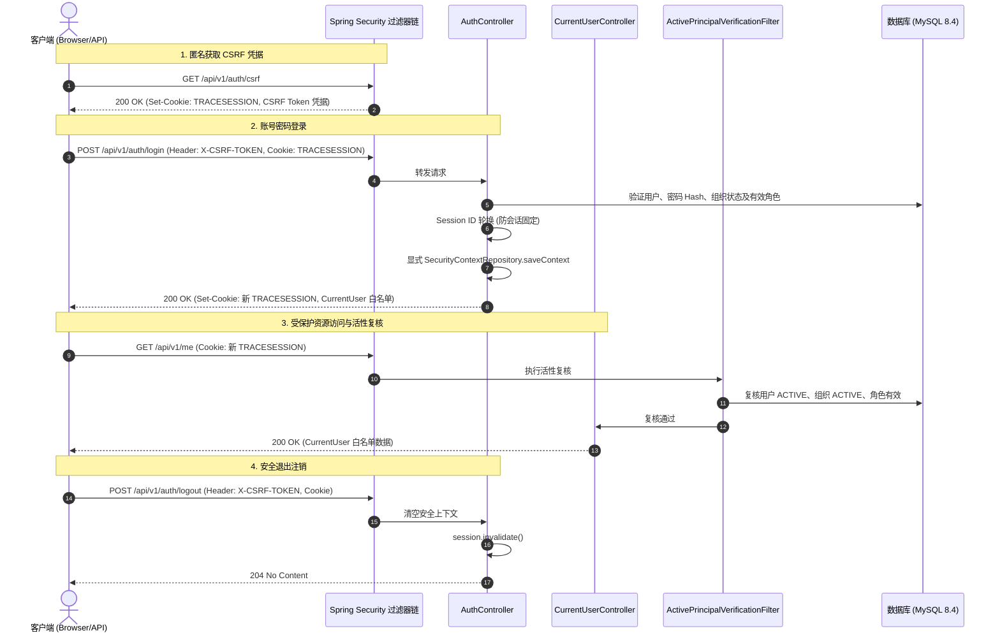
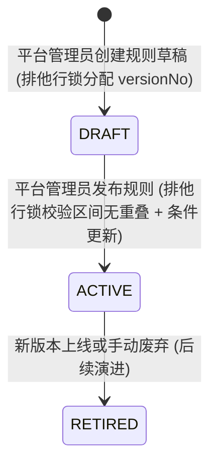
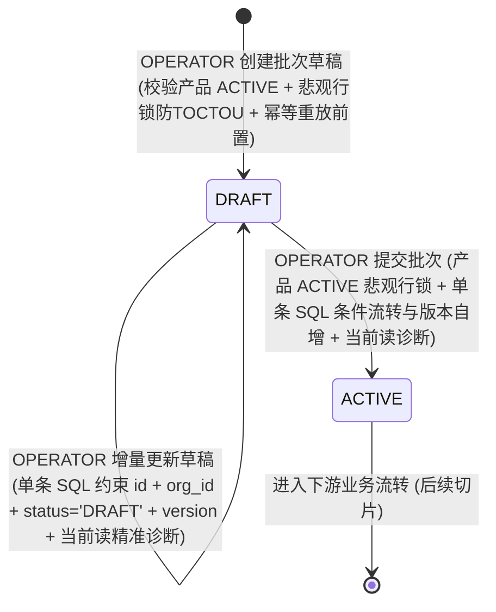
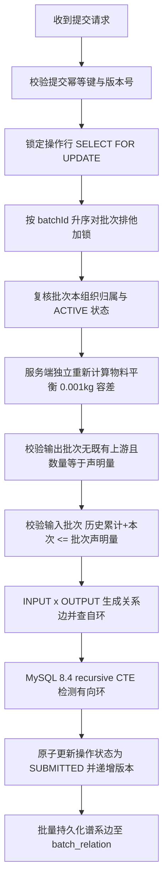

# Phase 3: 核心服务与最小闭环交付文档

本文档记录冷冻海产品溯源系统 Phase 3 的接口调用契约、安全设计机制、领域模型算法与测试分层规范：
1. **第一部分**：会话认证与组织上下文交付规范（GitHub Issue #7 “session authentication and organization context”）
2. **第二部分**：产品主数据与分阶段温控规则交付规范（GitHub Issue #9 “product master data and versioned temperature rules”）
3. **第三部分**：组织范围批次草稿生命周期交付规范（GitHub Issue #11 “organization-scoped batch draft lifecycle”）
4. **第四部分**：批次操作、物料平衡与谱系边交付规范（GitHub Issue #13 “batch operations, mass balance, and genealogy edges”）

---

# 第一部分：会话认证与组织上下文交付文档 (Session Auth & Organization Context)

本文档记录冷冻海产品溯源系统 Phase 3（GitHub Issue #7 “session authentication and organization context”）的接口调用契约、安全设计机制、测试分层策略以及真实数据库验证规范。

---

## 一、核心目标与安全边界

1. **服务端会话认证体系**：基于 Spring Security 7 与 Servlet 容器安全会话构建，采用命名为 `TRACESESSION` 的 HttpOnly、SameSite=Lax Cookie 维持登录态。
2. **组织上下文唯一服务端推导**：客户端严禁向服务端传递 `orgId`。组织上下文由服务端根据当前登录主体绑定的组织数据唯一确立。
3. **严格白名单数据投影**：所有面向客户端的当前用户信息（`/api/v1/me`）仅包含白名单安全属性（`userId`, `username`, `displayName`, `orgId`, `orgNo`, `orgName`, `orgType`, `roles`, `scopes`），严禁暴露 `passwordHash`、`creditCode` 等内部敏感字段。
4. **无固定演示账号与无预植入密码原则**：
   - Flyway 迁移脚本严格限定为 DDL，禁止新增或修改 V1 迁移脚本，绝对不在迁移中写入演示账号或密码 Hash 种子；
   - 代码中无任何硬编码默认账号密码；
   - 真实集成测试运行时动态生成随机密码与临时数据，并在测试结束后执行彻底的物理清理。

---

## 二、接口调用契约与交互时序



### 1. 获取 CSRF Token (`GET /api/v1/auth/csrf`)
- **权限**：匿名公开访问；
- **说明**：基于 `HttpSessionCsrfTokenRepository` 获取 CSRF Token，同时触发服务端安全会话的初始化；
- **响应**：
  - `Set-Cookie: TRACESESSION=<sessionId>; Path=/; HttpOnly; SameSite=Lax`
  - 响应体：
    ```json
    {
      "data": {
        "headerName": "X-CSRF-TOKEN",
        "parameterName": "_csrf",
        "token": "<uuid-token>"
      },
      "meta": {
        "requestId": "<req-id>",
        "timestamp": "2026-09-04T22:50:00Z"
      }
    }
    ```

### 2. 用户登录 (`POST /api/v1/auth/login`)
- **权限**：公开访问，但**强制校验 CSRF Token**；
- **入参**：
  ```json
  {
    "username": "user123",
    "password": "RawPassword123!"
  }
  ```
- **核心逻辑**：
  1. 数据库用户认证：校验加盐密码哈希（BCrypt）、用户状态（`ACTIVE` 且 `is_deleted=0`）、所属组织状态（`ACTIVE` 且 `is_deleted=0`）及已分配启用角色；
  2. 防会话固定攻击：调用 `SessionAuthenticationStrategy` 进行 Session ID 轮换；
  3. 上下文持久化：显式调用 `SecurityContextRepository.saveContext`；
  4. 登录审计更新：更新用户 `last_login_at` 字段为当前 UTC 时间。
- **错误收敛**：
  - 未知用户名、错误密码、锁定账户、停用账户、停用组织、未分配有效角色，对外统一收敛为 **`401 AUTH_CREDENTIALS_INVALID`**，不向调用方泄露账号存在性或状态信息。

### 3. 获取当前用户信息 (`GET /api/v1/me`)
- **权限**：已登录受保护资源；
- **说明**：从服务端安全上下文 `TraceSecurityPrincipal` 中获取当前登录用户的组织上下文、角色编码和权限作用域，白名单安全输出。
- **响应示例**：
  ```json
  {
    "data": {
      "userId": 1,
      "username": "alice",
      "displayName": "爱丽丝",
      "orgId": 100,
      "orgNo": "ORG_001",
      "orgName": "深蓝捕捞集团",
      "orgType": "SOURCE",
      "roles": ["OPERATOR"],
      "scopes": ["ORG_ONLY"]
    },
    "meta": {
      "requestId": "<req-id>",
      "timestamp": "2026-09-04T22:50:00Z"
    }
  }
  ```

### 4. 退出登录 (`POST /api/v1/auth/logout`)
- **权限**：已登录受保护资源，需要 CSRF；
- **说明**：清除 `SecurityContext` 并调用 `session.invalidate()` 使服务端会话失效；
- **响应**：`204 No Content`。

---

## 三、全局动态活性复核机制

通过 `ActivePrincipalVerificationFilter`（置于 `AuthorizationFilter` 之前）对每个受保护请求进行实时数据库状态与安全上下文复核：
1. **用户活性复核**：查询数据库确认用户未被逻辑删除，且状态为 `ACTIVE`；
2. **组织归属一致性复核**：比较数据库最新 `user.orgId` 与认证主体 `principal.orgId`，防止管理员调整组织归属后旧会话跨组织越权；
3. **组织活性复核**：查询数据库确认用户所属组织未被逻辑删除，且状态为 `ACTIVE`；
4. **角色与权限集合一致性复核**：查询数据库当前分配给用户的有效角色与作用域集合，与 `principal` 中的角色及作用域进行无序集合（Set）比对。任何角色撤销、替换、增加或作用域范围调整，均能被即时侦测。

**失效处理**：
任一复核失败时，立即：
- 清理 `SecurityContextHolder.clearContext()`；
- 使会话强制失效 `session.invalidate()`；
- 拦截请求，直接输出统一 RFC 9457 Problem Details（状态码 `401`，错误码 `AUTH_REQUIRED`）。

---

## 四、测试分层策略与执行方法

### 1. 默认测试套件（无外置依赖，用于 CI 快速门禁与离线验证）
完全使用 MockMvc 与 MockitoBean，不依赖任何真实外部服务与网络：
- `SampleControllerTest`：基础示例端点、响应封套与全局异常验证；
- `TraceUserDetailsServiceTest`：用户状态多维度校验与异常类型纯单元测试；
- `AuthControllerTest`：覆盖 CSRF 校验、登录参数边界约束（3..64, 8..128）、登录成功会话、会话固定防护轮换、白名单字段投影、统一错误收敛（密码错误、用户锁定、停用、组织停用、无角色）、注销失效、组织归属变更即刻下线、角色/作用域集合变更即刻下线、无序角色集合稳定放行。

**执行命令（需在 `server` 目录下执行）**：
```powershell
# 从仓库根目录进入 server
cd server
# Windows PowerShell
.\mvnw.cmd clean test
```

### 2. 真实 MySQL 8.4 集成测试（受条件环境变量控制）
测试类：`AuthMysqlIntegrationTest`
- **控制条件**：仅在环境变量 `MYSQL_IT_ENABLED=true` 时激活；若未启用或数据库未就绪则在默认构建中安全跳过（Skipped）；
- **物理清理**：注入 `JdbcTemplate`，在 `@AfterEach` 中按 `user_role` -> `app_user` -> `role` -> `organization` 依赖顺序执行真实物理 `DELETE FROM`，不受 `@TableLogic` 影响，确保即使被测数据被标记逻辑删除也能彻底物理清空；
- **执行逻辑**：
  1. 测试动态调用密码加盐算法生成随机密码；
  2. 动态生成带随机唯一编码的测试组织、角色、用户和用户角色关联，写入 MySQL 8.4 真实库；
  3. 执行端到端完整测试：获取真实 CSRF Token -> 错误密码 401 -> 正确密码登录 -> 验证防会话固定与返回主体 -> `/me` 白名单查询 -> 修改数据库将用户/组织置为 `INACTIVE` 或调整组织归属 -> 再次访问 `/me` 验证 401 且会话失效 -> 注销；
  4. 最终在 `tearDown` 中彻底物理删除插入的临时测试数据。

**在本地真实 MySQL 环境中执行该测试的方式**：
```powershell
# 1. 在仓库根目录启动本地 Docker 数据库（映射 3307 端口）
docker compose --env-file .env -f deploy/docker-compose.yml up -d --wait

# 2. 从根目录安全加载 .env 到当前 PowerShell 环境变量（静默设置，不回显敏感密钥/密码）并开启集成测试门禁
Get-Content .env | ForEach-Object {
    $line = $_.Trim()
    if ($line -and -not $line.StartsWith('#') -and $line.Contains('=')) {
        $parts = $line.Split('=', 2)
        [System.Environment]::SetEnvironmentVariable($parts[0].Trim(), $parts[1].Trim(), 'Process')
    }
}
$env:MYSQL_IT_ENABLED = "true"

# 3. 推荐命令：进入 server 目录执行全量 clean test（全量测试通过）
cd server
.\mvnw.cmd clean test
```

> **测试范围与命令区别说明**：
> - **单独运行 `AuthMysqlIntegrationTest`**（命令：`.\mvnw.cmd test -Dtest=AuthMysqlIntegrationTest`）：仅单独执行 Phase 3 身份与会话层在真实数据库上的集成验证（覆盖 CSRF 校验、BCrypt 密码校验、会话固定防护、`/me` 白名单数据投影、数据库组织及角色活性动态复核、注销会话失效及测试数据物理销毁），耗时较短，适合在聚焦 identity 模块时快速迭代验证。
> - **全量测试（包含 `MysqlMigrationIntegrationTest`，推荐命令：`.\mvnw.cmd clean test`）**：不仅包含全部离线单元/Mock 测试和上述 Phase 3 认证集成测试，还会执行 Phase 2 的 `MysqlMigrationIntegrationTest`，在真实 MySQL 8.4 容器中完整验证 Flyway V1 迁移脚本的幂等执行、全量表结构与索引完整性。在交付验收阶段强烈推荐使用全量命令，确保数据模型与会话鉴权体系端到端完全闭环。
>
> **环境验证记录**：本项目已在本机基于 Docker 编排的 MySQL 8.4.0 容器（宿主机 3307 端口隔离）环境下完成全量测试套件验证，`MysqlMigrationIntegrationTest` 与 `AuthMysqlIntegrationTest` 全部绿标通过（0 failures, 0 errors, 0 skipped），测试数据在 `@AfterEach` 中彻底物理清理，无敏感密码哈希泄露，无复合主键告警。

---

# 第二部分：产品主数据与分阶段温控规则 (Issue #9)

## 一、核心目标与职责边界

严格遵循 GitHub Issue #9 与系统架构规范，实现产品主数据（Product）的生命周期管理以及分阶段、可版本化的温控基准规则（TemperatureRule / TemperatureRuleStage）：

1. **业务边界隔离**：
   - 本模块仅限于海产品主数据的新建、查询、更新以及温控基准方案与阶段参数的定义与发布；
   - **不实现**批次管理（Batch）、不接入实时温度记录时序流、不执行告警判定与模拟召回、不提供组织管理或前端页面。
2. **四层分层架构**：
   - 严格遵循 `web -> application -> domain -> mapper/infrastructure` 分层设计；
   - 表现层 Controller 严禁直接调用持久层 Mapper，所有事务控制、业务校验、行级锁并发控制均收敛在应用服务层（`ProductApplicationService` 与 `TemperatureRuleApplicationService`）。
3. **安全与权限边界**：
   - **读权限**：所有已认证企业用户与平台用户均具备只读查询权限，可查询产品列表/详情，并允许查看关联的温控规则列表及明细（包含 `DRAFT` 草稿规则，供生产排程计划查阅）；
   - **写权限**：创建产品、更新产品、创建规则草稿、发布规则必须具备平台管理权限（`TraceSecurityPrincipal.scopes` 包含 `PLATFORM`），企业端非平台用户写操作一律返回 **`403 ACCESS_DENIED`**；
   - **审计字段注入**：`createdBy` 与 `updatedBy` 严格由服务端从当前安全上下文提取，绝不信任客户端入参；
   - **敏感字段屏蔽**：响应 DTO 仅暴露白名单业务字段，严禁泄露 `isDeleted` 内部逻辑删除标识。

---

## 二、领域模型与生命周期约束

### 1. 实体核心属性与规范

- **产品 (Product)**：
  - `id`：主键 ID；
  - `productCode`（库字段 `product_code`）：全局唯一业务编码，格式如 `PRD-FSH-001`；
  - `publicName`：面向消费者的公开规范名称；
  - `scientificName`：学名（拉丁名/学名），可选；
  - `category`：规范化品类大写代码（`FISH`, `CRUSTACEAN`, `SHELLFISH`, `CEPHALOPOD`, `OTHER`）；
  - `specification`：规格描述（如 `500g-600g/条`、`整条装`）；
  - `sourceType`：规范化来源大写代码（`DOMESTIC_CAPTURE`, `DOMESTIC_FARMED`, `IMPORT`）；
  - `baseUnitCode`：基础计量单位，Phase 1 严格限定为 `kg`，非 `kg` 返回 400 `INVALID_REQUEST`；
  - `status`：状态（`DRAFT`, `ACTIVE`, `INACTIVE`）；
  - `version`：乐观锁版本号（更新时必须递增比对）。

- **温控规则方案 (TemperatureRule)**：
  - `id`：方案 ID；
  - `productId`：关联产品 ID；
  - `versionNo`：方案版本序号（同一产品下从 1 严格自增，数据库复合唯一键约束 `uk_rule_product_version`）；
  - `name`：规则方案名称（如 `冷冻带鱼温控基准v1`）；
  - `effectiveFrom`：生效起始时间（包含，ISO 8601 UTC 存储）；
  - `effectiveTo`：生效结束时间（不包含，可为 null 表示长期有效；不为空时必须严格大于 `effectiveFrom`）；
  - `status`：方案状态（`DRAFT` 草稿、`ACTIVE` 生效中、`RETIRED` 已废弃）；
  - `basisNote`：标准制定依据说明（如国标编号、企业标准）。

- **温控环节明细 (TemperatureRuleStage)**：
  - `id`：明细 ID；
  - `ruleId`：关联方案 ID；
  - `stageCode`：供应链环节代码（`PROCESSING`, `STORAGE`, `TRANSPORT`, `RETAIL`，同一方案内环节代码排他唯一）；
  - `lowerLimit` / `upperLimit`：温度阈值下限与上限（`DECIMAL(6,2)`，整数最多 4 位，小数最多 2 位，必须满足 `lowerLimit <= upperLimit`）；
  - `unitCode`：温标单位，严格限定为 `CELSIUS`（摄氏度）；
  - `allowedDurationSeconds`：允许越界缓冲秒数（必须 `>= 0`，默认 0）；
  - `sequenceNo`：展示次序号（必须 `>= 1`，默认 1）。

### 2. 数据库物理约束保障 (Flyway V2)

在 `V2__product_rule_constraints.sql` 中补充 MySQL 8.4 物理级 CHECK 约束与复合唯一索引，杜绝非法脏数据穿透，实际物理约束名称如下：
- `chk_product_category`：限定品类枚举值；
- `chk_product_source_type`：限定来源枚举值；
- `chk_product_status`：限定产品状态值；
- `chk_product_base_unit_code`：限定基础单位必须为 `kg`；
- `uk_rule_product_version`：同一产品下规则版本序号唯一 `(product_id, version_no)`；
- `chk_rule_status`：限定规则状态值；
- `chk_rule_effective_period`：限定 `effective_to IS NULL OR effective_to > effective_from`；
- `uk_stage_rule_stage_code`：同一规则方案下环节代码唯一 `(rule_id, stage_code)`；
- `chk_stage_code`：限定环节代码枚举值；
- `chk_stage_unit_code`：限定温标单位必须为 `CELSIUS`；
- `chk_stage_limits`：限定 `lower_limit <= upper_limit`；
- `chk_stage_duration`：限定 `allowed_duration_seconds >= 0`；
- `chk_stage_sequence`：限定 `sequence_no >= 1`。

---

## 三、并发控制与发布状态机



1. **版本号生成并发串行化**：
   - 新建规则草稿时，通过 `productMapper.selectByIdForUpdate(productId)` 对所属产品加排他行锁；
   - 在事务内锁定产品后，查询当前产品最大 `versionNo`，执行 `maxVersion + 1`，彻底杜绝并发新建草稿时的版本号冲突。
2. **规则发布防竞态与半开区间冲突检测**：
   - 发布规则前同样锁定所属产品行（`selectByIdForUpdate`）；
   - 锁定后重新读取规则最新记录，二次确认规则状态仍为 `DRAFT`；
   - 校验当前产品状态必须为 `ACTIVE`；
   - 执行半开区间 `[effectiveFrom, effectiveTo)` 冲突判定算法：
     - 若待发布规则与库内已有的 `ACTIVE` 规则在时间线上发生交集，立即拒绝并抛出 `422 TEMPERATURE_RULE_EFFECTIVE_CONFLICT`；
     - 允许区间紧邻相接（例如 `[2026-01-01, 2026-06-01)` 与 `[2026-06-01, 2026-12-01)` 不重叠）。
3. **原子条件更新与版本递增防御并发假成功**：
   - 使用状态条件更新 + 版本递增（`version = version + 1`）：
     `UPDATE temperature_rule SET status = 'ACTIVE', version = version + 1, ... WHERE id = #{id} AND status = 'DRAFT' AND is_deleted = 0`；
   - 显式检查返回值 `affectedRows`，若受影响行数为 0，表明规则状态已被并发线程修改，立即抛出 **`409 INVALID_STATE_TRANSITION`**，杜绝返回假成功。

---

## 四、API 接口调用契约 (遵循 ISO 8601 与显式 UTC 偏移)

所有 API 遵循统一设计规范：请求与响应中的时间必须携带明确偏移量（例如 `+00:00` 或 `Z`），服务端统一转为 UTC 时间持久化。

### 1. 创建海产品主数据 (`POST /api/v1/products`)
- **权限**：平台管理员（`PLATFORM` scope），需要 CSRF；
- **入参**：
  ```json
  {
    "productCode": "PRD-FSH-001",
    "publicName": "舟山大黄鱼",
    "scientificName": "Larimichthys crocea",
    "category": "fish",
    "specification": "500g-600g/条",
    "sourceType": "import",
    "baseUnitCode": "kg"
  }
  ```
  *(注：`category` 与 `sourceType` 支持大小写混写，服务端自动转换为标准大写入库；`baseUnitCode` 目前仅支持 `kg`)*
- **响应**：`201 Created`
  ```json
  {
    "data": {
      "id": 100,
      "productCode": "PRD-FSH-001",
      "publicName": "舟山大黄鱼",
      "scientificName": "Larimichthys crocea",
      "category": "FISH",
      "specification": "500g-600g/条",
      "sourceType": "IMPORT",
      "baseUnitCode": "kg",
      "status": "DRAFT",
      "version": 0,
      "createdAt": "2026-09-07T08:00:00Z",
      "createdBy": 1,
      "updatedAt": "2026-09-07T08:00:00Z",
      "updatedBy": 1
    },
    "meta": {
      "requestId": "01J...",
      "timestamp": "2026-09-07T16:00:00+08:00"
    }
  }
  ```

### 2. 分页查询产品列表 (`GET /api/v1/products`)
- **权限**：所有已登录用户；
- **查询参数**：
  - `page`：页码，从 1 开始，默认 1（传 `<=0` 返回 400 `INVALID_REQUEST`）；
  - `size`：分页大小，默认 20，取值范围 `1..100`（超出返回 400 `INVALID_REQUEST`）；
  - `keyword`：模糊匹配产品编码（`productCode`）或公开名称（`publicName`）；
  - `category` / `sourceType` / `status`：精确过滤（自动规范化为大写）。
- **响应**：`200 OK`
  ```json
  {
    "data": [
      {
        "id": 100,
        "productCode": "PRD-FSH-001",
        "publicName": "舟山大黄鱼",
        "category": "FISH",
        "sourceType": "IMPORT",
        "baseUnitCode": "kg",
        "status": "ACTIVE",
        "version": 1
      }
    ],
    "meta": {
      "requestId": "01J...",
      "timestamp": "2026-09-07T16:00:00+08:00",
      "page": {
        "number": 1,
        "size": 20,
        "totalElements": 1,
        "totalPages": 1
      }
    }
  }
  ```

### 3. 乐观锁更新海产品 (`PATCH /api/v1/products/{id}`)
- **权限**：平台管理员（`PLATFORM` scope），需要 CSRF；
- **入参**：
  ```json
  {
    "publicName": "东海舟山大黄鱼",
    "status": "ACTIVE",
    "version": 0
  }
  ```
- **并发冲突**：若入参 `version` 与当前库内最新版本不一致，返回 **`409 VERSION_CONFLICT`**。

### 4. 创建温控规则草稿 (`POST /api/v1/products/{productId}/temperature-rules`)
- **权限**：平台管理员（`PLATFORM` scope），需要 CSRF；
- **入参**：
  ```json
  {
    "name": "东海大黄鱼冷链流通温控方案v1",
    "effectiveFrom": "2026-06-01T08:00:00+08:00",
    "effectiveTo": "2026-12-31T20:00:00+08:00",
    "basisNote": "依据 GB/T 32204-2015 水产品冷链物流规范",
    "stages": [
      {
        "stageCode": "PROCESSING",
        "lowerLimit": -35.00,
        "upperLimit": -30.00,
        "unitCode": "CELSIUS",
        "allowedDurationSeconds": 0,
        "sequenceNo": 1
      },
      {
        "stageCode": "STORAGE",
        "lowerLimit": -25.00,
        "upperLimit": -18.00,
        "unitCode": "CELSIUS",
        "allowedDurationSeconds": 600,
        "sequenceNo": 2
      }
    ]
  }
  ```
- **业务校验规则**：
  - `effectiveFrom` 必须有效；若提供 `effectiveTo` 则必须严格大于 `effectiveFrom`；支持任意合法带时区输入，服务端换算为 UTC 持久化；
  - `lowerLimit` 不得高于 `upperLimit`（违规返回 422 `TEMPERATURE_RULE_INVALID_LIMITS`）；
  - `unitCode` 仅支持 `CELSIUS`（违规返回 422 `INVALID_TEMPERATURE_UNIT`）；
  - 温度阈值整数最多 4 位，小数最多 2 位（违规返回 400 `INVALID_REQUEST`）；
  - `allowedDurationSeconds >= 0`、`sequenceNo >= 1`（违规返回 400 `INVALID_REQUEST`）；
  - 规则草稿创建成功后，初始状态为 `DRAFT`。

### 5. 发布温控规则 (`POST /api/v1/temperature-rules/{id}/publish`)
- **权限**：平台管理员（`PLATFORM` scope），需要 CSRF；
- **约束前置检查**：
  - 所属产品状态必须为 `ACTIVE`（草稿或停用产品返回 422 `PRODUCT_NOT_ACTIVE`）；
  - 规则自身必须处于 `DRAFT` 状态（重复发布返回 409 `INVALID_STATE_TRANSITION`）；
  - 待发布规则的半开区间 `[effectiveFrom, effectiveTo)` 不得与当前产品已发布的生效中规则重叠（冲突返回 422 `TEMPERATURE_RULE_EFFECTIVE_CONFLICT`）；
  - 发布更新返回 0 行时抛出 409 `INVALID_STATE_TRANSITION`；
- **发布结果**：成功将规则状态流转为 **`ACTIVE`**，通用乐观锁字段 `version` 从 0 原子递增为 1（响应及数据库持久状态同步递增），规则成为不可变基准。

### 6. 查询产品温控规则版本列表 (`GET /api/v1/products/{productId}/temperature-rules`)
- **权限**：所有已登录用户；
- **说明**：按版本序号（`versionNo`）升序列出该产品下的所有规则方案（包含草稿、生效中方案及其环节明细），白名单输出，杜绝泄露 `isDeleted`。企业端已登录用户可查看草稿规则但不授予修改权限。

---

## 五、测试分层策略与执行方法

### 1. 默认测试套件（无外置依赖，用于本地与 CI 快速门禁）

默认测试完全采用纯单元测试（MockitoExtension）与 Web 契约切片测试（WebMvcTest + MockMvc + MockitoBean），不依赖 Docker 或真实外部网络，可在无容器环境下极速运行。

| 测试类 | 覆盖范围与测试目标 |
|---|---|
| `ProductApplicationServiceTest` | 产品创建校验、代码查重冲突（409）、枚举大小写规范化、非 kg 单位拦截、分页查询过滤、乐观锁版本冲突（409）与行锁验证。 |
| `TemperatureRuleApplicationServiceTest` | 悲观行锁串行化版本生成、草稿状态校验（409）、环节空/重复/逆序阈值拦截（422）、半开区间防重叠判定、原子条件更新 0 行防并发冲突（409）。 |
| `ProductControllerTest` | 匿名 401、操作员写 403、平台管理员写 201、参数校验（400，含 `page=0` 与 `size=999` 分页边界、非 kg 单位）、响应封套与时间格式验证。 |
| `TemperatureRuleControllerTest` | 匿名 401、操作员只读可查（包含草稿规则）但写 403、参数校验（400，含 4 位整数 2 位小数超限、负缓冲秒数、非正序号）、带 `+08:00` 偏移的 ISO 8601 输入转 UTC 语义与带 `Z` 偏移响应契约测试。 |

**执行命令（需在 `server` 目录下执行）**：
```powershell
cd server
.\mvnw.cmd clean test
```

### 2. 真实 MySQL 8.4 集成测试（受条件环境变量控制）

测试类：`ProductRuleMysqlIntegrationTest`
- **控制条件**：受环境变量 `MYSQL_IT_ENABLED=true` 控制；若本地未启动 Docker 容器或未显式配置，则在默认构建中自动安全跳过（Skipped），不影响构建结果；
- **测试内容**：
  1. 真实会话与 CSRF 流程；
  2. 真实产品创建、分页检索与乐观锁版本控制；
  3. 温控规则草稿创建与行锁版本自增（v1、v2、v3）；
  4. 规则发布状态机流转与区间重叠排他拒绝；
  5. **Flyway V2 物理 CHECK 约束拦截能力验证**：绕过应用服务直插数据库，验证非法品类、非法单位（非 kg）、反向阈值（lowerLimit > upperLimit）、非法温标（非 CELSIUS）、负缓冲秒数和非正次序号均被 MySQL 8.4 物理约束精准拦截并抛出包含具体约束名的 `DataAccessException`（底层携带 MySQL 错误码 3819）；
  6. 数据清理：在 `@AfterEach` 中按依赖反向顺序执行物理 `DELETE FROM`，保持数据库纯净。

**在本地真实 MySQL 环境中运行该测试的方式**：
```powershell
# 1. 在仓库根目录启动本地 Docker 数据库（映射 3307 端口）
docker compose --env-file .env -f deploy/docker-compose.yml up -d --wait

# 2. 从根目录安全加载 .env 到当前 PowerShell 环境变量
Get-Content .env | ForEach-Object {
    $line = $_.Trim()
    if ($line -and -not $line.StartsWith('#') -and $line.Contains('=')) {
        $parts = $line.Split('=', 2)
        [System.Environment]::SetEnvironmentVariable($parts[0].Trim(), $parts[1].Trim(), 'Process')
    }
}
$env:MYSQL_IT_ENABLED = "true"

# 3. 运行全量集成测试
cd server
.\mvnw.cmd clean test
```

---

# 第三部分：组织范围批次草稿生命周期交付规范 (Issue #11)

## 一、核心目标与职责边界

严格遵循 GitHub Issue #11 与整体架构设计，实现基础批次（Batch）草稿的创建、组织范围隔离分页查询、详情查看、增量更新及提交流转：

1. **业务范围收敛**：
   - 本切片仅实现基础批次的生命周期流转（`DRAFT -> ACTIVE`）；
   - **不实现**批次拆分、合并、加工（`batch_operation`）、不生成谱系边（`batch_relation`）、不记录追溯事件（`trace_event`）、不生成或暴露消费者公开追溯码（`public_trace_code`）、不处理业务冻结/召回/关闭。
2. **分层架构与控制反转**：
   - 严格遵循 `web -> application -> domain -> mapper` 四层设计；
   - 表现层 `BatchController` 严禁直接调用持久层 `BatchMapper`，所有跨表校验、权限检查、并发版本控制与幂等重试逻辑统一收敛于应用服务层 `BatchApplicationService`。
3. **安全与组织隔离边界**：
   - **写权限拦截**：创建草稿、更新草稿、提交激活强制要求企业操作员角色（`TraceSecurityPrincipal.roles` 必须包含 `OPERATOR`）；系统管理员按 RBAC 原则默认只读企业业务，无权代写，违者返回 **`403 ACCESS_DENIED`**；
   - **组织上下文唯一服务端推导**：`orgId`、操作人 `userId`、审计时间及初始 `DRAFT` 状态严格由服务端生成，绝对不信任客户端传递；
   - **读权限与数据范围隔离**：
     - `PLATFORM` 作用域角色可查询全平台批次；
     - 其余所有企业端已认证用户在列表查询时**必须在 Mapper/SQL 层强制限定 `org_id = principal.orgId`**，杜绝先查全表再在内存过滤；
     - 详情查询强制校验所有权：库内已存在但属于其他组织的批次，返回 **`403 ORG_SCOPE_DENIED`**；批次不存在返回 **`404 RESOURCE_NOT_FOUND`**；
   - **严格白名单数据投影**：响应仅暴露白名单业务属性，严禁泄露 `isDeleted` 逻辑删除标记及 `creationIdempotencyKey` 内部防重键；所有审计时间输出带明确 UTC 偏移的 ISO 8601 格式字符串。

---

## 二、领域模型与生命周期约束

### 1. 实体核心属性与规范

- **追溯批次主表 (Batch)**：
  - `id`：内部自增主键；
  - `orgId`（库字段 `org_id`）：当前持有企业组织 ID；
  - `productId`（库字段 `product_id`）：关联海产品主数据 ID（创建与提交时必须处于 `ACTIVE` 状态）；
  - `batchNo`（库字段 `batch_no`）：业务批次号，同组织内排他唯一（复合唯一索引 `uk_batch_org_no`），不同组织允许复用同一批次号；
  - `batchType`（库字段 `batch_type`）：批次环节枚举（`SOURCE`, `PROCESSING`, `DISTRIBUTION`, `SALE`）；
  - `quantity`（库字段 `quantity`）：批次初始/声明数量，可用量派生，`DECIMAL(18,3)`，必须 `> 0` 且最多保留 3 位小数；
  - `unitCode`（库字段 `unit_code`）：计量单位，Phase 1 严格限定为 `kg`，传入其他单位返回 400 `INVALID_REQUEST`；
  - `originType`（库字段 `origin_type`）：水产品来源枚举（规范大写代码：`DOMESTIC_CAPTURE`, `DOMESTIC_FARMED`, `IMPORT`）；
  - `originText`（库字段 `origin_text`）：企业端完整来源产地文本描述（最长 255 字符）；
  - `productionDate`（`production_date`）：生产加工日期（`LocalDate`，可选）；
  - `captureDate`（`capture_date`）：捕捞出塘日期（`LocalDate`，可选）；
  - `freezeDate`（`freeze_date`）：速冻完成日期（`LocalDate`，可选）；
  - `shelfLifeDays`（`shelf_life_days`）：保质期天数（可选，若提供必须 `> 0`）；
  - `status`（库字段 `status`）：批次生命周期状态（`DRAFT`, `ACTIVE`, `FROZEN`, `RECALLED`, `CLOSED`）；
  - `creationIdempotencyKey`（库字段 `creation_idempotency_key`）：创建防重幂等键（最长 128 字符，同组织唯一，响应 DTO 屏蔽）；
  - `version`：乐观锁版本号（草稿更新与提交成功时原子递增）；
  - `createdAt` / `updatedAt`：UTC 创建/更新时间。

### 2. 数据库物理级约束保障 (Flyway V3)

在 `V3__batch_constraints.sql` 中新增幂等键字段、同组织唯一索引及 MySQL 8.4 物理级 CHECK 约束：
- `uk_batch_org_idempotency`：同一组织下创建幂等键唯一 `(org_id, creation_idempotency_key)`；
- `chk_batch_batch_type`：限定批次类型枚举值域 `('SOURCE', 'PROCESSING', 'DISTRIBUTION', 'SALE')`；
- `chk_batch_origin_type`：限定来源枚举值域 `('DOMESTIC_CAPTURE', 'DOMESTIC_FARMED', 'IMPORT')`；
- `chk_batch_status`：限定批次状态值域 `('DRAFT', 'ACTIVE', 'FROZEN', 'RECALLED', 'CLOSED')`；
- `chk_batch_quantity`：限定数量必须严格大于 0 (`quantity > 0`)；
- `chk_batch_unit_code`：限定基础单位必须为 `kg` (`unit_code = 'kg'`)；
- `chk_batch_shelf_life_days`：限定保质期天数必须可空或大于 0 (`shelf_life_days IS NULL OR shelf_life_days > 0`)。

---

## 三、并发控制、幂等防重与安全隔离机制



1. **创建防重幂等键机制与当前读（Locking Read）并发竞态恢复**：
   - 客户端在 `POST /api/v1/batches` 中强制携带 `Idempotency-Key` 请求头（长度限定为 16..128 字符）；
   - 服务端首先查询 `(org_id, creationIdempotencyKey)` 进行同组织幂等预检：
     - 若已存在且完整业务载荷相同（批号、产品、类型、数量、单位、来源、日期、保质期），直接返回原批次封套且不重复插入（即使产品在创建后变为 `INACTIVE` 仍正常重放）；
     - 若已存在但载荷语义不一致，立即拒绝并抛出 **`409 IDEMPOTENCY_CONFLICT`**；
   - **MySQL REPEATABLE READ 隔离级别当前读恢复机制**：在 MySQL 默认的 `REPEATABLE READ` 隔离级别下，事务内首次普通 `SELECT` 会建立 Read View 快照视图。若两个并发请求同时发起首次创建，另一个事务成功插入并提交后，本事务并发 `insert` 必然抛出 `DuplicateKeyException`。此时若使用普通快照读将无法看到另一事务已提交的记录，导致幂等重试误报为 `BATCH_NO_CONFLICT`。因此服务端必须采用当前锁定读 `SELECT ... FOR UPDATE`（`selectByOrgIdAndIdempotencyKeyForUpdate` 与 `selectByOrgIdAndBatchNoForUpdate`）穿透快照读盲区，精确获取存储引擎最新已提交行，正确返回原批次响应或判定真实批次号冲突。
2. **单条 SQL 条件更新与当前读版本/状态精准分类**：
   - 草稿更新与提交均执行单条原子更新 SQL：
     `UPDATE batch SET ... version = version + 1 WHERE id = #{id} AND org_id = #{orgId} AND status = 'DRAFT' AND version = #{version} AND is_deleted = 0`；
   - 检查返回值 `affectedRows`，若受影响行数为 0，同样通过当前锁定读 `selectByIdIgnoreTenantForUpdate(batchId)` 打破前置快照盲区，获取底层存储引擎最新记录，杜绝将并发状态变更（如已被并发提交为 ACTIVE）误分类为版本冲突（`VERSION_CONFLICT`），精准区分：
     - 批次不存在：抛出 **`404 RESOURCE_NOT_FOUND`**；
     - 跨组织越权：抛出 **`403 ORG_SCOPE_DENIED`**；
     - 状态非草稿（如并发已被提交变为 ACTIVE）：抛出 **`409 INVALID_STATE_TRANSITION`**；
     - 版本号不匹配（请求版本为旧值）：抛出 **`409 VERSION_CONFLICT`**。
3. **关联产品活性强校验与排他行锁（TOCTOU 竞态消除）**：
   - 创建批次（首次非重放）与提交激活批次前，均强制复核关联产品的最新状态；
   - 采用 `productMapper.selectByIdForUpdate(productId)` 对产品记录加排他悲观行锁，确保在批次创建落库或草稿激活提交流转事务完成前，关联产品不能被并发事务停用，彻底消除“检查时为 ACTIVE 但流转时已停用”的 TOCTOU（Time-of-Check to Time-of-Use）竞态；
   - 幂等命中重放路径绝不查询或锁定产品，保障高并发只读重试的高吞吐。
4. **软删除批号与幂等键复用边界说明**：
   - 软删除批号与幂等键复用策略属于未来删除/归档生命周期规范；本切片严格收敛于基础批次生命周期（`DRAFT -> ACTIVE`），系统不提供批次删除接口，保持数据库物理唯一索引 `(org_id, batch_no)` 与 `(org_id, creation_idempotency_key)` 约束稳定，不变更现有索引结构。

---

## 四、API 接口调用契约 (遵循 ISO 8601 与显式 UTC 偏移)

### 1. 创建批次草稿 (`POST /api/v1/batches`)
- **权限**：企业操作员（`OPERATOR` 角色），强制校验 CSRF；
- **请求头**：`Idempotency-Key: <16..128字符>`；
- **入参**：
  ```json
  {
    "batchNo": "BATCH-20260908-001",
    "productId": 100,
    "batchType": "SOURCE",
    "quantity": 100.500,
    "unitCode": "kg",
    "originType": "DOMESTIC_CAPTURE",
    "originText": "东海舟山渔场3号捕捞作业区",
    "productionDate": "2026-09-01",
    "captureDate": "2026-09-01",
    "freezeDate": "2026-09-02",
    "shelfLifeDays": 180
  }
  ```
- **响应**：`201 Created`
  ```json
  {
    "data": {
      "id": 1000,
      "orgId": 10,
      "productId": 100,
      "batchNo": "BATCH-20260908-001",
      "batchType": "SOURCE",
      "quantity": 100.500,
      "unitCode": "kg",
      "originType": "DOMESTIC_CAPTURE",
      "originText": "东海舟山渔场3号捕捞作业区",
      "productionDate": "2026-09-01",
      "captureDate": "2026-09-01",
      "freezeDate": "2026-09-02",
      "shelfLifeDays": 180,
      "status": "DRAFT",
      "version": 0,
      "createdAt": "2026-09-08T09:30:00Z",
      "createdBy": 101,
      "updatedAt": "2026-09-08T09:30:00Z",
      "updatedBy": 101
    },
    "meta": {
      "requestId": "01J...",
      "timestamp": "2026-09-08T17:30:00+08:00"
    }
  }
  ```

### 2. 分页查询批次列表 (`GET /api/v1/batches`)
- **权限**：所有已登录用户；
- **过滤参数**：`status`（状态精确过滤，支持 `DRAFT/ACTIVE/FROZEN/RECALLED/CLOSED`）、`page`（从 1 开始，默认 1）、`size`（1~100，默认 20）；
- **响应**：`200 OK`，包含 `meta.page` 分页元数据。

### 3. 获取批次详情 (`GET /api/v1/batches/{batchId}`)
- **权限**：所有已登录用户；本组织或 `PLATFORM` scope 可查；跨组织已存在返回 403 `ORG_SCOPE_DENIED`，不存在返回 404；
- **响应**：`200 OK`，白名单数据投影。

### 4. 增量更新批次草稿 (`PATCH /api/v1/batches/{batchId}`)
- **权限**：企业操作员（`OPERATOR` 角色），强制校验 CSRF；
- **入参**（仅允许修改数量、产地描述、日期与保质期天数）：
  ```json
  {
    "version": 0,
    "quantity": 120.000,
    "originText": "更新后的产地说明",
    "shelfLifeDays": 240
  }
  ```
- **响应**：`200 OK`，`version` 原子递增为 1。

### 5. 提交激活批次草稿 (`POST /api/v1/batches/{batchId}/submit`)
- **权限**：企业操作员（`OPERATOR` 角色），强制校验 CSRF；
- **入参**：
  ```json
  {
    "version": 1
  }
  ```
- **流转前置校验**：关联海产品必须处于 `ACTIVE` 状态；批次当前必须为 `DRAFT` 状态；版本号必须匹配；
- **响应**：`200 OK`，批次 `status` 流转为 `ACTIVE`，`version` 原子递增。

---

## 五、测试分层策略与执行方法

### 1. 默认测试套件（CI 快速门禁与离线快速验证）
采用纯单元测试（MockitoExtension）与 WebMvc 切片测试（WebMvcTest + MockMvc），不依赖外置容器：
- `BatchApplicationServiceTest`：覆盖合法创建、非 OPERATOR 拒绝（403）、缺失/短幂等键（400）、非法枚举/单位/数量/保质期（400）、关联产品不存在（404）与停用（422）、批次号冲突（409）、同幂等键重试与语义冲突（409）、并发 DuplicateKey 恢复、草稿更新版本自增、跨组织更新拒绝（403）、旧版本冲突（409）、非草稿更新与提交拒绝（409）、草稿提交为 ACTIVE、跨组织详情拒绝（403）与全平台/本组织分页隔离。
- `BatchControllerTest`：覆盖全接口匿名拦截（401）、写操作 CSRF 防护（403）、分页边界参数拦截（400）、缺少必填字段/版本号拦截（400）、白名单响应投影与带 UTC 偏移量的 ISO 8601 时间格式校验。

**执行命令（需在 `server` 目录下执行）**：
```powershell
cd server
.\mvnw.cmd clean test
```

### 2. 真实 MySQL 8.4 集成测试（受条件环境变量控制）
测试类：`BatchMysqlIntegrationTest`
- **控制条件**：仅在环境变量 `MYSQL_IT_ENABLED=true` 时激活；未配置时在默认构建中安全跳过（Skipped）；
- **物理清理**：注入 `JdbcTemplate`，在 `@AfterEach` 中先按 `org_id` 彻底物理清理测试组织下的全部 `batch`（涵盖 MockMvc 接口生成与直接 SQL 插入），再按依赖反向顺序清理 `product -> user_role -> app_user -> role -> organization`，确保测试成功或失败均不污染数据库；
- **测试内容**：
  1. 真实会话登录与 CSRF 流程；
  2. 双组织环境验证：组织 A 与组织 B 均可创建相同批次号，同组织内批次号排他冲突；
  3. 组织 A 列表查询与详情查询严格隔离，组织 B 跨组织访问组织 A 批次返回 403 `ORG_SCOPE_DENIED`；
  4. 关联停用产品创建批次返回 422 `PRODUCT_NOT_ACTIVE`；
  5. 幂等键重放与冲突检测：同组织同 key 且归一化载荷相同时返回原批次（即使关联产品在创建后变为 `INACTIVE` 仍成功重放原批次）；不同载荷优先返回 409 `IDEMPOTENCY_CONFLICT`；
  6. 平台管理员（`PLATFORM` scope）跨组织读列表，普通企业用户读隔离，平台非 `OPERATOR` 用户写操作拦截（403 `ACCESS_DENIED`）；
  7. 草稿增量更新版本自增与提交流转为 ACTIVE；
  8. **Flyway V3 物理 CHECK 约束拦截能力验证**：绕过应用层直插数据库，验证非法批次类型、非法来源类型、非法批次状态、数量小于等于 0、单位非 kg、保质期天数小于等于 0 以及重复幂等键均被 MySQL 8.4 物理约束精准拦截并抛出包含具体约束名（如 `chk_batch_batch_type`、`chk_batch_quantity`、`uk_batch_org_idempotency` 等）的 `DataAccessException`；
  9. **MySQL REPEATABLE READ 快照读盲区与当前读穿透证据**：在同一 `TRANSACTION_REPEATABLE_READ` 事务中，普通快照读无法看到并发事务后提交的记录，而当前锁定读（`SELECT ... FOR UPDATE`）能够穿透快照读盲区，直接读取到底层最新已提交行；
  10. **并发幂等双请求竞争验证**：两个并发线程携带相同幂等键同时发起创建请求，由数据库唯一索引和并发竞态恢复机制协同处理，只生成一行记录且两线程返回相同的批次 ID。

---

# 第四部分：批次操作、物料平衡与谱系边交付规范 (Issue #13)

## 一、核心目标与职责边界

严格遵循 GitHub Issue #13 与系统整体架构规范，实现批次操作草稿的创建、物料平衡计算、批次可用量与唯一来源强校验、有向图成环检测、两套独立幂等键以及谱系边的事务写入：

1. **业务边界隔离**：
   - 完整表达冷冻海产品的拆分（`SPLIT`）、合并（`MERGE`）、加工（`PROCESS`）与分装（`REPACK`）多对多业务拓扑，杜绝退化为固定线性流程；
   - **不实现**谱系查询 API（`GET /batches/{id}/genealogy`）、图谱 UI 交互、库存台账自动扣减、单位非 kg 的换算规则及草稿删除。
2. **安全与权限边界**：
   - 创建草稿与提交操作强制要求企业操作员角色（`TraceSecurityPrincipal.roles` 必须包含 `OPERATOR`），平台管理员及其他角色无权代写（返回 403 `ACCESS_DENIED`）；
   - 跨组织访问或操作其他企业批次返回 403 `ORG_SCOPE_DENIED`；
   - 响应严格执行白名单投影，绝不泄露逻辑删除标识 `isDeleted` 与内部幂等防重键。
3. **批次数量语义确立**：
   - `batch.quantity` 严格保持为批次的初始/声明数量；批次的当前可用量与消耗量统一由已提交操作明细累计派生。

---

## 二、领域模型与生命周期约束

### 1. 实体核心属性与规范

- **批次操作主表 (BatchOperation)**：
  - `id`：主键 ID；
  - `orgId`（`org_id`）：执行组织 ID（服务端推导）；
  - `operationNo`（`operation_no`）：业务流水单号（服务端自动生成）；
  - `operationType`（`operation_type`）：操作类型（`MERGE`, `SPLIT`, `PROCESS`, `REPACK`）；
  - `occurredAt`（`occurred_at`）：业务实际发生时间（UTC）；
  - `recordedAt`（`recorded_at`）：系统登记时间（UTC，服务端生成）；
  - `status`：生命周期状态（`DRAFT` 草稿，`SUBMITTED` 已提交，`CORRECTED` 已更正）；
  - `idempotencyKey`（`idempotency_key`）：创建防重幂等键（16..128 字符，同组织唯一）；
  - `submissionIdempotencyKey`（`submission_idempotency_key`）：提交防重幂等键（16..128 字符，同组织唯一）；
  - `note`：操作备注（最长 500 字符）；
  - `version`：乐观锁版本号（草稿提交时自增）。

- **批次操作明细项目表 (BatchOperationItem)**：
  - `id`：明细 ID；
  - `operationId`（`operation_id`）：关联操作 ID；
  - `batchId`（`batch_id`）：关联批次 ID（`INPUT`/`OUTPUT` 必须提供；`LOSS`/`WASTE`/`SAMPLE` 严禁提供）；
  - `role`：项目角色（`INPUT`, `OUTPUT`, `LOSS`, `WASTE`, `SAMPLE`）；
  - `quantity`：数量（必须 `> 0` 且最多 3 位小数）；
  - `unitCode`（`unit_code`）：计量单位（Phase 1 限定为 `kg`）；
  - `normalizedQuantity`（`normalized_quantity`）：折算基准单位数量（当前阶段恒等于 `quantity`）。

- **批次谱系图谱边表 (BatchRelation)**：
  - `id`：主键 ID；
  - `operationId`（`operation_id`）：引起关系的转换操作 ID；
  - `parentBatchId`（`parent_batch_id`）：原料父批次 ID；
  - `childBatchId`（`child_batch_id`）：产出子批次 ID；
  - `relationType`（`relation_type`）：关系类型（`MERGE`, `SPLIT`, `TRANSFORM`）；
  - `createdAt`（`created_at`）：创建时间（UTC）。

### 2. 数据库物理级约束保障 (Flyway V4)

在 `V4__batch_operation_constraints.sql` 中补充 MySQL 8.4 物理约束与复合唯一索引：
- `uk_op_org_idempotency`：同一组织下创建幂等键唯一 `(org_id, idempotency_key)`；
- `uk_op_org_submission_idempotency`：同一组织下提交幂等键唯一 `(org_id, submission_idempotency_key)`；
- `chk_op_type`：限定操作类型枚举 `('MERGE', 'SPLIT', 'PROCESS', 'REPACK')`；
- `chk_op_status`：限定操作状态枚举 `('DRAFT', 'SUBMITTED', 'CORRECTED')`；
- `chk_item_role`：限定明细角色枚举 `('INPUT', 'OUTPUT', 'LOSS', 'WASTE', 'SAMPLE')`；
- `chk_item_quantity`：限定明细数量严格大于 0；
- `chk_item_unit_code`：限定计量单位必须为 `kg`；
- `chk_item_normalized_quantity`：限定基准折算数量严格大于 0；
- `chk_relation_type`：限定关系类型枚举 `('TRANSFORM', 'SPLIT', 'MERGE')`；
- `chk_relation_no_self_loop`：限定父子批次不得自环 `(parent_batch_id <> child_batch_id)`。

---

## 三、物料平衡、环检测与并发安全机制



1. **物料平衡重新计算（Mass Balance）**：
   服务端独立累计计算：
   `sum(INPUT.normalizedQuantity) = sum(OUTPUT.normalizedQuantity) + sum(LOSS.normalizedQuantity) + sum(WASTE.normalizedQuantity) + sum(SAMPLE.normalizedQuantity)`
   容差设定为绝对值 `<= 0.001 kg`。不平衡立即抛出 422 `BATCH_MASS_BALANCE_VIOLATION`，事务完整回滚，不留痕迹。
2. **唯一产出来源与声明量一致性强校验**：
   - 输出批次在 `batch_relation` 中不能存在既有上游边，一个批次只能由一次已提交操作产出（违规报 422 `BATCH_OUTPUT_ALREADY_PRODUCED`）；
   - 输出明细数量必须与该批次声明数量一致（违规报 422 `BATCH_OUTPUT_QUANTITY_MISMATCH`）。
3. **输入累计量派生与不可超额占用校验**：
   - 统计该批次在所有状态为 `SUBMITTED` 的操作项目中的历史累计 INPUT 数量；
   - 要求 `历史已提交 INPUT + 本次 INPUT <= 批次声明数量`；超出报 422 `BATCH_QUANTITY_EXCEEDED`。
4. **MySQL 8.4 recursive CTE 成环检测**：
   - 对拟生成的每条 `parent -> child` 有向边，执行递归公用表表达式（CTE）遍历图谱；
   - 若从 `child` 出发沿着已提交下游边能到达 `parent`，则加入该边将形成环路，立即抛出 422 `BATCH_RELATION_CYCLE`。
5. **死锁防范与当前读恢复**：
   - 操作行先锁，涉及的批次按 `batchId` 严格数值升序排列逐行加锁；
   - 并发冲突通过锁定当前读 `SELECT ... FOR UPDATE` 穿透 `REPEATABLE READ` 快照读，实现精准幂等重放或状态分类。

---

## 四、API 接口调用契约

### 1. 创建批次操作草稿 (`POST /api/v1/batch-operations`)
- **权限**：企业操作员（`OPERATOR`），强制校验 CSRF；
- **请求头**：`Idempotency-Key: <16..128字符>`；
- **入参示例**：
  ```json
  {
    "operationType": "MERGE",
    "occurredAt": "2026-09-09T10:00:00+08:00",
    "note": "两产地扇贝原料合并清洗加工",
    "items": [
      { "role": "INPUT", "batchId": 101, "quantity": 600.000, "unitCode": "kg" },
      { "role": "INPUT", "batchId": 102, "quantity": 420.000, "unitCode": "kg" },
      { "role": "OUTPUT", "batchId": 103, "quantity": 480.000, "unitCode": "kg" },
      { "role": "OUTPUT", "batchId": 104, "quantity": 520.000, "unitCode": "kg" },
      { "role": "LOSS", "quantity": 20.000, "unitCode": "kg" }
    ]
  }
  ```
- **响应**：`201 Created`，返回包含系统生成流水号、时间、状态 `DRAFT` 及各项目的白名单封套。

### 2. 提交批次操作并生成谱系边 (`POST /api/v1/batch-operations/{operationId}/submit`)
- **权限**：企业操作员（`OPERATOR`），强制校验 CSRF；
- **请求头**：`Idempotency-Key: <16..128字符>`（独立提交防重键）；
- **入参示例**：
  ```json
  {
    "version": 0
  }
  ```
- **响应**：`200 OK`，返回状态 `SUBMITTED`、版本号递增至 1 的操作、明细以及生成的全部 `relations` 谱系边。

---

## 五、测试分层策略与执行方法

### 1. 默认测试套件（本地及 CI 离线门禁）
- `BatchOperationApplicationServiceTest`：纯业务逻辑单元测试（覆盖创建参数、基数约束、同键幂等重放与冲突诊断、物料平衡容差、输出批次已有上游拒绝、输入超额拒绝、自环拒绝、CTE 环检测拒绝、稳定顺序锁及提交流转）。
- `BatchOperationControllerTest`：WebMvc 切片契约测试（覆盖匿名 401、操作员权限与 CSRF 403、参数校验 400、白名单响应字段与 UTC 时间格式验证）。

### 2. 真实 MySQL 8.4 集成测试（环境变量控制）
- 测试类：`BatchOperationMysqlIntegrationTest`（受 `MYSQL_IT_ENABLED=true` 控制）
- 覆盖端到端标准链路（600kg+420kg -> 480kg+520kg+20kg损耗）、物料不平衡完整回滚、多跳环路检测回滚、双并发提交幂等恢复以及 Flyway V4 物理 CHECK 约束精准拦截验证。

