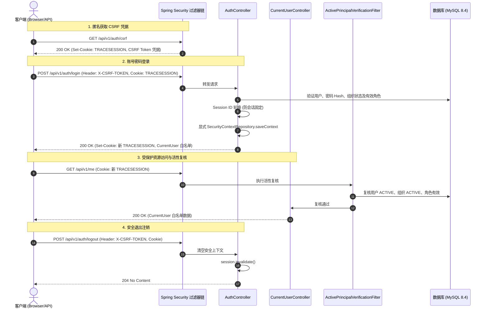

# Phase 3: 会话认证与组织上下文交付文档 (Session Auth & Organization Context)

本文档记录冷冻海产品溯源系统 Phase 3（GitHub Issue #7 “session authentication and organization context”）的接口调用契约、安全设计机制、测试分层策略以及真实数据库验证规范。

---

## 一、核心目标与安全边界

1. **服务端会话认证体系**：基于 Spring Security 7 与 Servlet 容器安全会话构建，采用命名为 `TRACESESSION` 的 HttpOnly、SameSite=Lax Cookie 维持登录态。
2. **组织上下文唯一服务端推导**：客户端严禁向服务端传递 `orgId`。组织上下文由服务端根据当前登录主体绑定的组织数据唯一确立。
3. **严格白名单数据投影**：所有面向客户端的当前用户信息（`/api/v1/me`）仅包含白名单安全属性（`userId`, `username`, `displayName`, `orgId`, `orgNo`, `orgName`, `orgType`, `roles`, `scopes`），严禁暴露 `passwordHash`、`creditCode` 等内部敏感字段。
4. **无固定演示账号与无预植入密码原则**：
   - Flyway 迁移脚本严格限定为 DDL，禁止新增或修改 V1 迁移脚本，绝对不在迁移中写入演示账号或密码 Hash 种子；
   - 代码中无任何硬编码默认账号密码；
   - 真实集成测试运行时动态生成随机密码与临时数据，并在测试结束后执行彻底的物理清理。

---

## 二、接口调用契约与交互时序



### 1. 获取 CSRF Token (`GET /api/v1/auth/csrf`)
- **权限**：匿名公开访问；
- **说明**：基于 `HttpSessionCsrfTokenRepository` 获取 CSRF Token，同时触发服务端安全会话的初始化；
- **响应**：
  - `Set-Cookie: TRACESESSION=<sessionId>; Path=/; HttpOnly; SameSite=Lax`
  - 响应体：
    ```json
    {
      "data": {
        "headerName": "X-CSRF-TOKEN",
        "parameterName": "_csrf",
        "token": "<uuid-token>"
      },
      "meta": {
        "requestId": "<req-id>",
        "timestamp": "2026-09-04T22:50:00Z"
      }
    }
    ```

### 2. 用户登录 (`POST /api/v1/auth/login`)
- **权限**：公开访问，但**强制校验 CSRF Token**；
- **入参**：
  ```json
  {
    "username": "user123",
    "password": "RawPassword123!"
  }
  ```
- **核心逻辑**：
  1. 数据库用户认证：校验加盐密码哈希（BCrypt）、用户状态（`ACTIVE` 且 `is_deleted=0`）、所属组织状态（`ACTIVE` 且 `is_deleted=0`）及已分配启用角色；
  2. 防会话固定攻击：调用 `SessionAuthenticationStrategy` 进行 Session ID 轮换；
  3. 上下文持久化：显式调用 `SecurityContextRepository.saveContext`；
  4. 登录审计更新：更新用户 `last_login_at` 字段为当前 UTC 时间。
- **错误收敛**：
  - 未知用户名、错误密码、锁定账户、停用账户、停用组织、未分配有效角色，对外统一收敛为 **`401 AUTH_CREDENTIALS_INVALID`**，不向调用方泄露账号存在性或状态信息。

### 3. 获取当前用户信息 (`GET /api/v1/me`)
- **权限**：已登录受保护资源；
- **说明**：从服务端安全上下文 `TraceSecurityPrincipal` 中获取当前登录用户的组织上下文、角色编码和权限作用域，白名单安全输出。
- **响应示例**：
  ```json
  {
    "data": {
      "userId": 1,
      "username": "alice",
      "displayName": "爱丽丝",
      "orgId": 100,
      "orgNo": "ORG_001",
      "orgName": "深蓝捕捞集团",
      "orgType": "SOURCE",
      "roles": ["OPERATOR"],
      "scopes": ["ORG_ONLY"]
    },
    "meta": {
      "requestId": "<req-id>",
      "timestamp": "2026-09-04T22:50:00Z"
    }
  }
  ```

### 4. 退出登录 (`POST /api/v1/auth/logout`)
- **权限**：已登录受保护资源，需要 CSRF；
- **说明**：清除 `SecurityContext` 并调用 `session.invalidate()` 使服务端会话失效；
- **响应**：`204 No Content`。

---

## 三、全局动态活性复核机制

通过 `ActivePrincipalVerificationFilter`（置于 `AuthorizationFilter` 之前）对每个受保护请求进行实时数据库状态与安全上下文复核：
1. **用户活性复核**：查询数据库确认用户未被逻辑删除，且状态为 `ACTIVE`；
2. **组织归属一致性复核**：比较数据库最新 `user.orgId` 与认证主体 `principal.orgId`，防止管理员调整组织归属后旧会话跨组织越权；
3. **组织活性复核**：查询数据库确认用户所属组织未被逻辑删除，且状态为 `ACTIVE`；
4. **角色与权限集合一致性复核**：查询数据库当前分配给用户的有效角色与作用域集合，与 `principal` 中的角色及作用域进行无序集合（Set）比对。任何角色撤销、替换、增加或作用域范围调整，均能被即时侦测。

**失效处理**：
任一复核失败时，立即：
- 清理 `SecurityContextHolder.clearContext()`；
- 使会话强制失效 `session.invalidate()`；
- 拦截请求，直接输出统一 RFC 9457 Problem Details（状态码 `401`，错误码 `AUTH_REQUIRED`）。

---

## 四、测试分层策略与执行方法

### 1. 默认测试套件（无外置依赖，用于 CI 快速门禁与离线验证）
完全使用 MockMvc 与 MockitoBean，不依赖任何真实外部服务与网络：
- `SampleControllerTest`：基础示例端点、响应封套与全局异常验证；
- `TraceUserDetailsServiceTest`：用户状态多维度校验与异常类型纯单元测试；
- `AuthControllerTest`：覆盖 CSRF 校验、登录参数边界约束（3..64, 8..128）、登录成功会话、会话固定防护轮换、白名单字段投影、统一错误收敛（密码错误、用户锁定、停用、组织停用、无角色）、注销失效、组织归属变更即刻下线、角色/作用域集合变更即刻下线、无序角色集合稳定放行。

**执行命令（需在 `server` 目录下执行）**：
```powershell
# 从仓库根目录进入 server
cd server
# Windows PowerShell
.\mvnw.cmd clean test
```

### 2. 真实 MySQL 8.4 集成测试（受条件环境变量控制）
测试类：`AuthMysqlIntegrationTest`
- **控制条件**：仅在环境变量 `MYSQL_IT_ENABLED=true` 时激活；若未启用或数据库未就绪则在默认构建中安全跳过（Skipped）；
- **物理清理**：注入 `JdbcTemplate`，在 `@AfterEach` 中按 `user_role` -> `app_user` -> `role` -> `organization` 依赖顺序执行真实物理 `DELETE FROM`，不受 `@TableLogic` 影响，确保即使被测数据被标记逻辑删除也能彻底物理清空；
- **执行逻辑**：
  1. 测试动态调用密码加盐算法生成随机密码；
  2. 动态生成带随机唯一编码的测试组织、角色、用户和用户角色关联，写入 MySQL 8.4 真实库；
  3. 执行端到端完整测试：获取真实 CSRF Token -> 错误密码 401 -> 正确密码登录 -> 验证防会话固定与返回主体 -> `/me` 白名单查询 -> 修改数据库将用户/组织置为 `INACTIVE` 或调整组织归属 -> 再次访问 `/me` 验证 401 且会话失效 -> 注销；
  4. 最终在 `tearDown` 中彻底物理删除插入的临时测试数据。

**在本地真实 MySQL 环境中执行该测试的方式**：
```powershell
# 1. 在仓库根目录启动本地 Docker 数据库（映射 3307 端口）
docker compose --env-file .env -f deploy/docker-compose.yml up -d --wait

# 2. 从根目录安全加载 .env 到当前 PowerShell 环境变量（静默设置，不回显敏感密钥/密码）并开启集成测试门禁
Get-Content .env | ForEach-Object {
    $line = $_.Trim()
    if ($line -and -not $line.StartsWith('#') -and $line.Contains('=')) {
        $parts = $line.Split('=', 2)
        [System.Environment]::SetEnvironmentVariable($parts[0].Trim(), $parts[1].Trim(), 'Process')
    }
}
$env:MYSQL_IT_ENABLED = "true"

# 3. 推荐命令：进入 server 目录执行全量 clean test（52/52 全量通过）
cd server
.\mvnw.cmd clean test
```

> **测试范围与命令区别说明**：
> - **单独运行 `AuthMysqlIntegrationTest`**（命令：`.\mvnw.cmd test -Dtest=AuthMysqlIntegrationTest`）：仅单独执行 Phase 3 身份与会话层在真实数据库上的集成验证（覆盖 CSRF 校验、BCrypt 密码校验、会话固定防护、`/me` 白名单数据投影、数据库组织及角色活性动态复核、注销会话失效及测试数据物理销毁），耗时较短，适合在聚焦 identity 模块时快速迭代验证。
> - **全量测试（包含 `MysqlMigrationIntegrationTest`，推荐命令：`.\mvnw.cmd clean test`）**：不仅包含全部 46 个离线单元/Mock 测试和上述 Phase 3 认证集成测试，还会执行 Phase 2 的 `MysqlMigrationIntegrationTest`，在真实 MySQL 8.4 容器中完整验证 Flyway V1 迁移脚本的幂等执行、全量表结构与索引完整性。在交付验收阶段强烈推荐使用全量命令，确保数据模型与会话鉴权体系端到端完全闭环。
>
> **环境验证记录**：本项目已在本机基于 Docker 编排的 MySQL 8.4.0 容器（宿主机 3307 端口隔离）环境下完成全量测试套件验证，`MysqlMigrationIntegrationTest` 与 `AuthMysqlIntegrationTest` 全部绿标通过（52 passed, 0 failures, 0 errors, 0 skipped），测试数据在 `@AfterEach` 中彻底物理清理，无敏感密码哈希泄露，无复合主键告警。
